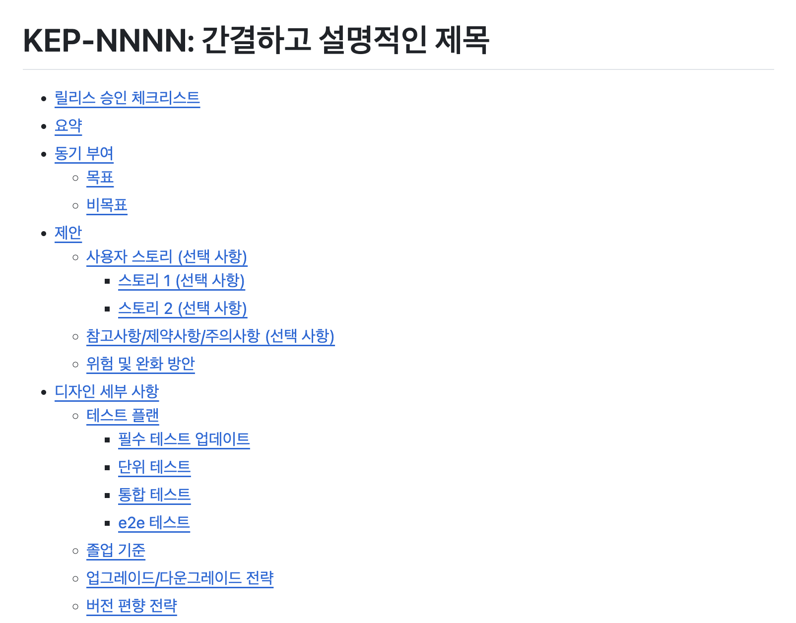

## etcd란?

etcd는 **Key-Value 형태의 데이터를 저장하는 분산 스토리지**입니다. CoreOS에서 개발했으며, 현재는 CNCF의 졸업 프로젝트로 관리되고 있습니다.

Kubernetes 클러스터에서 etcd가 다운되면 클러스터는 제대로 동작하지 못하게 되므로, **높은 신뢰성**을 제공해야 합니다.

### 주요 특징

- **강력한 일관성(Strong Consistency)**: Raft 합의 알고리즘 사용
- **고가용성(High Availability)**: 클러스터 구성으로 단일 장애점 제거
- **분산 환경 지원**: 여러 서버에 데이터 복제
- **Watch 기능**: 키 변경사항 실시간 감지
- **Revision 관리**: 모든 변경 이력 추적

## etcd의 데이터 모델

### Key-Value 저장 구조

```
/registry
  ├── /pods
  │   ├── /default/pod-1
  │   └── /default/pod-2
  ├── /services
  │   └── /default/my-service
  └── /configmaps
      └── /default/app-config
```

- **계층적 구조**: 디렉토리처럼 키를 구조화
- **Key-Value 쌍**: 모든 데이터는 키와 값으로 저장

### Revision (리비전)

etcd는 하나의 key에 대응되는 value를 하나만 저장하는 것이 아니라, **클러스터 생성 이후 key의 모든 변경사항을 기록**합니다.

```
Key: x
Revision 1: value = "1"
Revision 2: value = "2"
Revision 3: value = "3"
```

- 각 변경사항은 revision 번호로 추적
- 과거 시점의 데이터 조회 가능
- Compaction으로 오래된 revision 정리

### Log 기반 처리

etcd는 **command가 들어있는 log 단위로 데이터를 처리**합니다.

- 데이터 write = log append
- 받은 log를 순서대로 처리
- Log entry는 메모리에 보관 후 주기적으로 snapshot 생성

## etcd 구성 요소 (RSM)

### RSM (Replicated State Machine)

etcd는 **Replicated State Machine**입니다. 분산 컴퓨팅 환경에서 서버가 몇 개 다운되어도 잘 동작하는 시스템을 만들기 위한 방법으로, **똑같은 데이터를 여러 서버에 계속 복제**한다.



RSM의 특징:
- Command가 들어있는 **log 단위**로 데이터 처리
- 데이터 write = **log append**
- 받은 log를 **순서대로 처리**

### Consensus (합의)

Robust한 RSM을 만들기 위해서는 데이터 복제 과정에서 발생할 수 있는 문제를 해결하기 위해 **컨센서스(consensus) 확보**가 핵심입니다.

| 속성 | 설명 |
|------|------|
| **Safety** | 항상 올바른 결과를 리턴 |
| **Available** | 서버가 몇 대 다운되어도 항상 응답 |
| **Independent from timing** | 네트워크 지연 발생해도 로그 일관성 유지 |
| **Reactivity** | 모든 서버에 복제되지 않아도 조건 만족 시 빠르게 응답 |

etcd는 이를 위해 **Raft 알고리즘**을 사용합니다.

### 핵심 용어

#### Quorum (쿼럼)

**의사결정에 필요한 최소한의 서버 수**를 의미합니다.

- 계산식: `(전체 서버 수 / 2) + 1`
- 예: 3대 서버 → 쿼럼 2
- 예: 5대 서버 → 쿼럼 3

쿼럼 숫자만큼의 서버에 데이터 복제가 완료되면 작업 완료로 간주합니다.

#### State (상태)

etcd 서버는 다음 3가지 상태 중 하나를 가집니다:

- **Leader**: 클라이언트 요청 처리 및 로그 복제
- **Follower**: Leader의 로그를 복제하고 동기화
- **Candidate**: Leader 선출 과정의 임시 상태

추가로 **Learner** 상태도 존재합니다 (etcd 3.4.0+):
- 클러스터 멤버이지만 쿼럼 카운트에서 제외
- Log를 따라잡는 중인 새 멤버

#### Timer (타이머)

- **Heartbeat interval**: Leader가 Follower에게 주기적으로 heartbeat 전송
- **Election timeout**: 이 시간 동안 heartbeat를 받지 못하면 Leader가 없다고 간주

### 클러스터 구성

etcd는 **홀수 개의 노드**로 클러스터를 구성합니다.

| 클러스터 크기 | 쿼럼 | 허용 장애 노드 수 | 권장 사용 |
|--------------|------|------------------|----------|
| 1개 | 1 | 0개 | 개발/테스트 |
| 3개 | 2 | 1개 | 소규모 프로덕션 |
| 5개 | 3 | 2개 | 대규모 프로덕션 |
| 7개 | 4 | 3개 | 대규모 프로덕션 |

> **왜 홀수?** 과반수 합의를 위해 홀수가 효율적입니다. 4개와 5개 모두 2개 장애까지만 허용하므로, 5개가 더 경제적입니다.

## Raft 알고리즘

Raft는 etcd가 consensus를 확보하기 위해 사용하는 합의 알고리즘입니다.

### 1. Leader Election (리더 선출)

#### 초기 클러스터 구성

```
[Server 1]  [Server 2]  [Server 3]
Follower    Follower    Follower
Term: 0     Term: 0     Term: 0
```

1. 모든 서버가 **Follower** 상태로 시작
2. **Term**(임기) 값을 0으로 설정
3. Leader가 없으므로 heartbeat 없음

#### Election 과정

```
[Server 1]     [Server 2]     [Server 3]
Candidate  →   Follower       Follower
Term: 1        Term: 0        Term: 0
    ↓
RequestVote RPC
    ↓
[Server 2, 3] → OK 응답
    ↓
[Server 1] → Leader 선출
```

1. **Election timeout** 발생한 서버가 **Candidate**로 변경
2. Term 값을 1 증가
3. 다른 서버에게 **RequestVote RPC** 전송
4. 쿼럼만큼 OK 응답 받으면 **Leader** 선출
5. Leader는 주기적으로 **heartbeat** 전송

#### RequestVote 판단 기준

Follower는 다음을 비교하여 투표 결정:
- Candidate의 **term** 값
- Candidate의 **log index** (더 최신인지)

### 2. Log Replication (로그 복제)

#### Write 요청 처리

```
Client → Leader: write(x=1)
    ↓
Leader: lastIndex 증가, log 기록
    ↓
Leader → Followers: AppendEntry RPC
    ↓
Follower 1: log 기록 완료 → OK
Follower 2: 아직 기록 중...
    ↓
Leader: 쿼럼 달성 → Commit
```

1. 사용자가 Leader에게 write 요청
2. Leader가 자신의 log entry에 기록
3. **AppendEntry RPC**로 Follower들에게 전파
4. **쿼럼만큼 복제 완료**되면 **commit**
5. Commit = log entry → db(파일시스템)에 write

#### 주요 개념

- **lastIndex**: 각 서버가 가진 마지막 log 번호
- **nextIndex**: Leader가 알고 있는 Follower가 받을 다음 log 번호
- **Commit**: log entry의 데이터를 db에 영구 저장

### 3. Leader Down (리더 장애)

#### Leader 다운 시나리오

```
Leader 다운
    ↓
Follower들: election timeout
    ↓
Follower 2: Candidate로 변경
    ↓
Follower 1: RequestVote 거절 (더 최신 log 보유)
    ↓
Follower 1: election timeout → Candidate
    ↓
Follower 1: 새로운 Leader 선출
```

1. Leader가 다운되면 heartbeat 중단
2. Election timeout 발생한 Follower가 Candidate로 변경
3. **더 최신 log를 가진 서버**가 Leader로 선출
4. 새 Leader는 나머지 서버와 log 동기화

#### 구 Leader 복구

```
구 Leader 복구
    ↓
새 Leader로부터 heartbeat 수신
    ↓
자신의 term < 새 Leader의 term
    ↓
Follower로 변경, term 업데이트
```

- 낮은 term과 lastIndex를 가진 구 Leader는 자동으로 Follower로 전환

#### PreVote

연속된 election 실패로 인한 가용성 저하를 방지하기 위해:
- **Randomize election timeout**: 각 서버마다 다른 timeout 값
- **PreVote**: 실제 투표 전 사전 투표로 불필요한 election 방지

etcd는 PreVote를 구현하고 있습니다.

### 4. Runtime Reconfiguration (런타임 재구성)

#### 멤버 추가

```
3개 서버 클러스터 (쿼럼: 2)
    ↓
Client: 4번째 서버 추가 요청
    ↓
Leader: Cnew (config log) 생성
    ↓
Cnew는 entry에 쓰이자마자 효력 발휘
    ↓
새 쿼럼: 3 (4/2+1)
    ↓
쿼럼만큼 복제 후 commit
    ↓
Leader → 새 서버: snapshot 전송
```

**주의사항**:
- Config log는 **entry에 쓰이자마자 효력 발휘** (commit 전)
- 새 서버가 catch up 전에 또 다른 멤버 추가 시 **가용성 이슈** 발생 가능

#### Learner 상태

etcd 3.4.0부터 **Learner** 상태 도입:
- 클러스터 멤버이지만 **쿼럼 카운트에서 제외**
- Log를 충분히 따라잡은 후 **promote API**로 Follower로 승격
- 가용성 이슈 방지

#### Restriction

- **한 번에 하나씩** 멤버 추가/삭제
- Leader의 log에 **커밋되지 않은 config log**가 있으면 새 요청 거절

#### 멤버 삭제

```
Leader 삭제 요청 시:
    ↓
Leader: 자신을 제외한 쿼럼 계산
    ↓
자신 제외한 모든 서버에 Cnew 복제
    ↓
Commit 후 step down
    ↓
나머지 서버 중 새 Leader 선출
```

**Leader 삭제 시 특별 동작**:
- 자신을 제외한 쿼럼만큼 복제
- Commit 후 **step down** (Leader 역할 포기)
- 새 Leader 선출 보장

**Restriction**:
- `started < quorum`이 되는 삭제 요청은 거절
- 예: 5개 → 3개 → 2개 (OK), 2개 → 1개 (거절, started=1 < quorum=2)

## Kubernetes API Server가 etcd에 저장하는 데이터

### 저장되는 리소스

Kubernetes에서 etcd는 **모든 클러스터 상태를 저장**하는 유일한 데이터 저장소입니다.

```bash
# Pod 생성 예시
kubectl create pod nginx --image=nginx

# etcd에 저장되는 데이터
/registry/pods/default/nginx -> {
  "metadata": {
    "name": "nginx",
    "namespace": "default",
    ...
  },
  "spec": {
    "containers": [{
      "name": "nginx",
      "image": "nginx"
    }]
  },
  "status": {...}
}
```

### 주요 저장 데이터

#### 1. 리소스 정의
- **Pods**: 실행 중인 컨테이너 정보
- **Services**: 서비스 엔드포인트 및 설정
- **Deployments**: 배포 상태 및 스펙
- **ReplicaSets**: 복제본 관리 정보
- **StatefulSets**: 상태 유지 애플리케이션 정보

#### 2. 설정 데이터
- **ConfigMaps**: 애플리케이션 설정
- **Secrets**: 민감한 정보 (암호화 저장)

#### 3. 클러스터 메타데이터
- **Nodes**: 노드 상태 및 리소스 정보
- **Namespaces**: 네임스페이스 정의
- **Events**: 클러스터 이벤트 로그

#### 4. 정책 및 권한
- **RBAC**: Role, RoleBinding, ClusterRole 등
- **NetworkPolicies**: 네트워크 정책
- **PodSecurityPolicies**: Pod 보안 정책

### etcd 데이터 확인

```bash
# etcd Pod에 접속
kubectl exec -it etcd-master -n kube-system -- sh

# 모든 키 조회
etcdctl get / --prefix --keys-only

# 특정 리소스 조회
etcdctl get /registry/pods/default/nginx

# 특정 타입의 모든 리소스
etcdctl get /registry/pods --prefix --keys-only
```

### 데이터 저장 구조

```
/registry
  ├── /pods
  │   ├── /default/nginx
  │   ├── /default/redis
  │   └── /kube-system/coredns
  ├── /services
  │   ├── /default/kubernetes
  │   └── /default/my-service
  ├── /deployments
  │   └── /default/my-app
  ├── /configmaps
  │   └── /default/app-config
  ├── /secrets
  │   └── /default/db-password
  └── /nodes
      ├── /node-1
      └── /node-2
```

### API Server와 etcd의 상호작용

```
kubectl apply -f deployment.yaml
    ↓
API Server: 요청 검증
    ↓
API Server → etcd: write 요청
    ↓
etcd: Raft 합의 → commit
    ↓
API Server ← etcd: 성공 응답
    ↓
API Server → kubectl: 성공 응답
    ↓
Controller Manager: etcd watch로 변경 감지
    ↓
Controller Manager: 실제 리소스 생성
```

1. kubectl이 API Server에 요청
2. API Server가 etcd에 데이터 저장
3. etcd가 Raft 알고리즘으로 합의 후 commit
4. Controller Manager가 watch로 변경 감지
5. 실제 리소스 생성/수정

## 결론

etcd는 Kubernetes를 비롯한 분산 시스템의 핵심 구성요소입니다.

### 핵심 요약

- **무엇**: Key-Value 형태의 분산 스토리지
- **어떻게**: RSM + Raft 알고리즘으로 consensus 확보
- **왜**: 분산 시스템의 신뢰할 수 있는 단일 진실 공급원
- **어디서**: Kubernetes, Cloud Foundry, CoreDNS 등

### Raft 알고리즘의 핵심

1. **Leader Election**: 쿼럼 기반 리더 선출
2. **Log Replication**: 쿼럼만큼 복제 후 commit
3. **Fault Tolerance**: Leader 장애 시 자동 재선출
4. **Runtime Reconfiguration**: 동적 멤버 추가/삭제

### Kubernetes와 etcd

- API Server가 모든 리소스를 etcd에 저장
- etcd 장애 = Kubernetes 클러스터 장애
- 정기적인 백업 필수

## 참고 자료

- [etcd 공식 문서](https://etcd.io/docs/)
- [Raft 합의 알고리즘](https://raft.github.io/)
- [Kubernetes와 etcd](https://kubernetes.io/docs/concepts/overview/components/#etcd)
- [etcd Learner 설계](https://etcd.io/docs/v3.3.12/learning/learner/)
