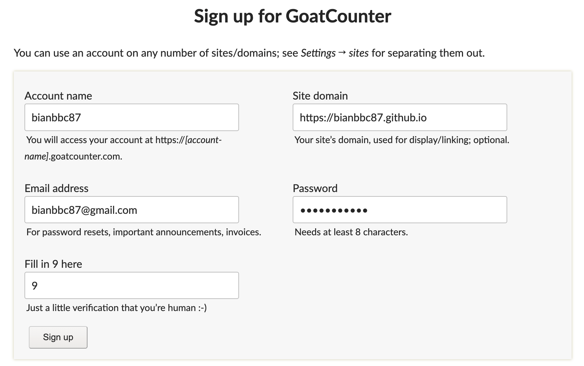

## Kubernetes Cluster
kubernetes cluster는 control plane과 컨테이너화 된 application을 실행하는 worker node 세트로 구성된 아키텍처이다.
모든 클러스터는 pod를 실행하기 위해 최소 하나 이상의 worker node가 필요하다.

## Kubernetes Node
Master Node는 Control Plane Component라 불리는 일련의 작업을 실행 합니다.

| 종류             | Control Plane (Master Node) | Worker Node |
|---------------------|:---------------------------------:|:-----------:|
| 정의             | 클러스터 내의 worker node와 pod를 관리하며, 의사 결정, 스케줄링 및 api 요청을 처리한다. | application을 구성하는 컨테이너 (pod)를 호스팅하는 머신이다. |
| 역할         | Manage, Plan, Schedule, Monitor Nodes  | Host Application as Containers |

 

## Control Plane (Master Node) Components

### Etcd Cluster
정보를 key-value 형식으로 저장하는 데이터베이스이다.

### Controller Manager
여러 기능에 대한 controller들의 모음

#### Node Controller
말 그대로 노드를 관리한다.
클러스터에 새 노드를 온보딩 하거나, 노드를 사용할 수 없게 되거나 파괴되는 상황을 처리한다.

#### Replication Controller
복제 그룹에서 항상 원하는 수의 컨테이너가 실행되도록 보장한다.

### Kube Scheduler
컨테이너 리소스 요구 사항, 워커 노드 용량 또는 Taint 및 허용 오차 혹은 노드 선호도 규칙과 같은 기타 정책이나 제약 조건에 따라 컨테이너를 배치할 노드를 식별한다.

### Kube APIServer
클러스터 내의 모든 작업을 오케스트레이션 하는 역할을 담당한다.
외부 사용자가 클러스터에서 관리 작업을 수행하는 데 사용되는 Kubernetes API와 클러스터의 상태를 모니터링 하고 워커 노드가 서버와 통신하는 데 필요한 변경을 수행하는 다양한 컨트롤러를 노출한다.

Kube APIServer는 주기적으로 Kubelet에서 상태 보고서를 가져와 노드와 그 위에 있는 컨테이너의 상태를 모니터링 한다.

 

## Worker Node Components

### Kubelet 
각 Node에서 실행되는 Agent
Kube API 서버의 지시를 수신하고 필요에 따라 노드에 컨테이너를 배포하거나 삭제한다.
즉, 마스터 노드와 Node 내부 컨테이너들 사이 연락망이다.

### Kube Proxy Service
Worker Node간 통신은 각 Node에 있는 Kube Proxy 서버에 의해 활성화 된다.
Worker Node에서 실행 중인 컨테이너가 서로 연결될 수 있도록 필요한 규칙이 Worker Node에 적용되도록 한다.

### Container Runtime Engine
컨테이너를 실행하기 위한 서비스 
가장 인기있는 것은 Docker이다. (그러나 현재 표준은 아님)
containerd, rkt (로켓) 등이 함께 사용된다.