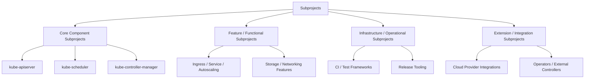

## Kubernetes란 ?
[k8s](https://kubernetes.io/ko/)라고도 알려진 kubernetes는 컨테이너화된 애플리케이션을 자동으로 배포, 스케일링 및 관리해주는 오픈소스 시스템

## Kubernetes의 기여 생태계

Kubernetes는 굉장히 큰 프로젝트여서인지 일반적인 프로젝트와 달리 복잡한 체계가 있다.
지난 v1.33 Kubernetes에서 Enhancements Shadow로 참여한 경험이 있어 경험 나누기 + Kubernetes 기여에 도움이 되는 문서를 기록하고자 한다.

### Kubernetes의 기여 생태 구조

**Kubernetes 프로젝트는 의사결정 조직, 작업 조직, 구현 단위, 릴리스 통제 조직이 명확히 분리되어 있다.** 요약하자면 다음과 같다.

| 구분              | CNCF                        | Steering Committee                          | SIGs / WGs                                                                   | Subprojects                                     |
| --------------- | --------------------------- | ------------------------------------------- | ---------------------------------------------------------------------------- | ----------------------------------------------- |
| **소개**          | Kubernetes를 호스팅·지원하는 비영리 재단 | Kubernetes 전체 프로젝트의 최고 의사결정 기구              | 실제 개발·운영 작업을 수행하는 조직 단위                                                      | SIG 산하의 **구체적 실행 단위(코드/프로젝트)**                  |
| **주요 역할**       | - 법적·재정적 보호<br>- 인프라/행정 지원  | - 프로젝트 전체 방향 결정<br>- SIG 생성/조정<br>- 거버넌스 관리 | - **SIG**: 특정 도메인 상설 담당 (Release, Networking 등)<br>- **WG**: 특정 주제 중심의 임시 조직 | - 기능/컴포넌트 구현<br>- 코드 오너십 및 유지보수                 |
| **의사결정 범위**     | Kubernetes 외부의 재단 레벨        | **전체 Kubernetes 프로젝트 범위**                   | 담당 도메인(Scope) 내 결정                                                           | 해당 컴포넌트/프로젝트 범위                                 |
| **지속성**         | 상설                          | 상설                                          | SIG: 상설 / WG: 임시                                                             | 보통 장기 유지                                        |
| **코드 직접 소유 여부** | ❌                           | ❌                                           | 일부(리뷰/정책 중심)                                                                 | ✅                                               |
| **예시**          | CNCF                        | Kubernetes Steering Committee               | SIG Release, SIG Networking                                                  | kubelet, api-machinery, etcd-related components |


즉, Steering Commitee, SIGs / WGs 는 의사결정 조직이고 Subprojects는 실제 구현의 단위이다.
특정 Subproject(또는 여러 Subproject)에 대해 기능 개선(KEP, PR, 구현) 을 수행하기 위해 형성되는 역할 기반 기여 구조를 가진다.

```bash
CNCF
 └─ Steering Committee
     ├─ SIGs / WGs
     │   └─ Subprojects
     │       └─ Enhancements (KEP / PR / 구현)
     └─ SIG Release
         └─ Release Team
```

## 실제 구현 단위, Subproject

### SubProject 의 종류
Subproject는 Kubernetes 내에서 구현 책임의 단위이며, 그 성격에 따라 다음과 같이 분류할 수 있다.



- Core Component Subprojects: Kubernetes의 핵심 컨트롤 플레인 및 런타임 컴포넌트
- Feature / Functional Subprojects: Kubernetes의 기능적 동작을 담당
- Infrastructure / Operational Subprojects: Kubernetes 자체 기능보다는 프로젝트 운영과 품질을 지원
- Extension / Integration Subprojects: Kubernetes 외부 시스템과의 연동 또는 확장

### Subproject의 기여 권한 구조

**각 SubProject별로 다음과 같은 오픈소스 기여의 권한 구조를 가지게 된다.**

```bash
Subproject
 ├─ Owner # 최종 책임자, 방향성과 오너십 보유
 ├─ Approver # PR / KEP 승인 권한
 ├─ Reviewer # 코드/설계 리뷰 담당
 ├─ Member # 지속적 기여자
 └─ Non-member Contributors # 외부 기여자
```

<br />

## Kubernetes Release Team

[Kubernetes Release Team](https://github.com/kubernetes/sig-release/blob/master/release-team/README.md)은 SIG Release에 소속되어 성공적인 릴리즈에 필요한 업무들을 담당한다. 정책/개선을 담당하는 SIG와 달리, 매 릴리즈 사이클마다 구성되는 실무 조직이다.

Release Team은 단순 조율 조직이 아니라, 실질적인 결정권을 가진다.
1. 공식 릴리즈 날짜에 릴리즈를 빌드하고 배포할 권한
- CNCF의 명의 하에 수행
2. 릴리즈 브랜치에 대한 cherrypick 승인/거절
- 릴리즈를 위협하는 코드 변경 사항 되돌리기(revert)
3. 릴리즈 기준을 만족하지 못한 기능을 `Feature Flag` 뒤로 숨길 권한
3. Code Freeze 기간 중
- kubernetes/kubernetes master(main) 브랜치 PR 승인/거절
- 릴리즈 대상이 아닌 변경은 Submit Queue에서 차단
4. 안정성·품질에 문제가 생길 경우
- 릴리즈 일정 자체를 변경할 권한

### Kubernetes Release 유형
Kubernetes 릴리즈는 3가지 유형으로 나뉜다.

| 유형    | 예시    | 설명          |
| ----- | ----- | ----------- |
| Major | x.0.0 | 대규모 구조 변화   |
| Minor | x.y.0 | 기능 추가 중심    |
| Patch | x.y.z | 버그 수정 / 안정화 |

**여기서 Release Team은 각 릴리즈 타입마다 구성된다.**

### Release Team의 책임과 역할

Release Team은 릴리즈 사이클마다 다음 역할을 수행해야 한다.
1. Release 노트 생성
- 해당 릴리즈에 포함되는 주요 변경 사항, 기능 추가, 버그 수정 사항을 정리하여 공식 Release Note를 작성한다.
- 사용자와 운영자가 릴리즈의 영향도를 빠르게 파악할 수 있도록 구조화된 형태로 제공한다.
2. Release repository, code 포함 기준 설정 및 실행
- 릴리즈에 포함될 수 있는 Repository 및 Code에 대한 기준을 정의한다.
- 정의된 기준에 따라 실제 릴리즈 과정에서 코드 포함 여부를 검토·판단·집행한다.
3. Release 상태 커뮤니케이션
- 릴리즈 상태 보고 템플릿 정의
- 정기적인 릴리즈 상태 업데이트
4. Release Signal 수집 및 분석
- TestGrid 결과, Github flaky test 이슈, Github 버그 이슈 등 데이터를 기반으로 릴리즈 가능 여부를 판단한다.
5. Kubernetes/Enhancements 관리
- 릴리즈 대상 Enhancement를 관리하고 추적한다.
- Enhancement burndown 프로세스를 정의하여 릴리즈 목표 대비 진행 상황을 가시화한다.

> Enhancement burndown 프로세스란
> 릴리즈 목표 시점까지, 미완성/리스크 있는 Enhancement를 0으로 만드는 과정

### Release Team 구성 역할
Release Team은 각 릴리즈 타입마다 구성된다. 다음과 같은 역할(Role)로 나뉘며, 각자 명확한 책임을 가진다.

| 역할                | 담당 영역        |
| ----------------- | ------------ |
| Release Team Lead | 전체 릴리즈 총괄    |
| Enhancements      | 기능 개선 트래킹    |
| Release Signal    | 테스트·CI 신호 관리 |
| Docs              | 문서 상태 관리     |
| Communications    | 커뮤니케이션 및 공지  |

### Release Team Shadow
Release Team Shadow는 Release Team에 신규 기여자를 위한 **멘토링 프로그램**이다. Release Team Lead는 누구나 1명 이상의 멘티를 선정하여 프로세스에 참관하게 함으로써 향후 Release Team의 인력 충원을 도와줄 수 있다.
**Release Team Shadow 경험이 풍부한 사람은 다음 Release Team에서 Lead를 맡을 수도 있다.**

