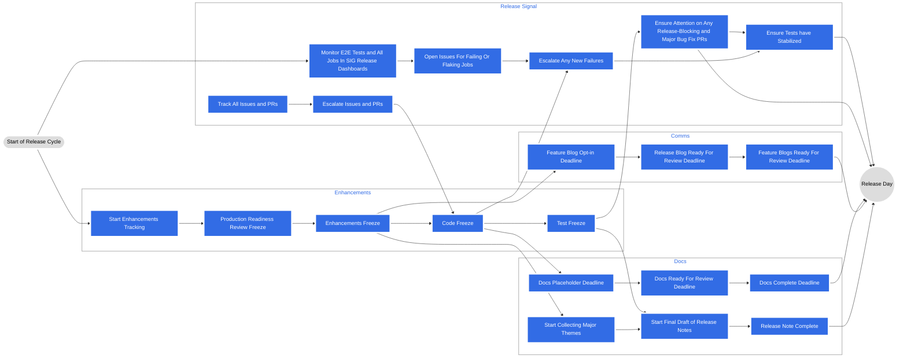

## Kubernetes란 ?
[k8s](https://kubernetes.io/ko/)라고도 알려진 kubernetes는 컨테이너화된 애플리케이션을 자동으로 배포, 스케일링 및 관리해주는 오픈소스 시스템

## Kubernetes의 기여 생태계

## KEP (Kubernetes Enhancement Proposal)

KEP란 새로운 기능이나 개선에 대해 설명하는 문서이다.
Kubernetes 공식 가이드 상 **문서를 읽는 모두가 아이디어를 읽고 동의할 수 있도록 하는 것**이 목적이다.

KEP Template은 [여기](https://github.com/kubernetes/enhancements/tree/master/keps/NNNN-kep-template)를 참고하세요.

KEP에 대한 YAML 파일을 `kep.yaml`이라고 부르며, 핵심 아이디어를 빠르게 확인할 수 있다. (예를 들어 현재 어떤 상태인지에 대해서)

`kep.yaml`의 예시는 [여기](https://github.com/kubernetes/enhancements/blob/master/keps/sig-architecture/0000-kep-process/kep.yaml)를 참고하세요.

PRR은 Production Readiness Review Process로, 신규 기능이 프로덕션 환경에서 안정하고 확장 가능하며 운영 지원이 가능한지 보장하기 위한 절차이다.
1. KEP 작성자가 PRR 설문지를 작성한다.
2. SIG 리드가 검토한다.
3. SIG 승인 후, PRR 승인을 요청한다.
4. PRR Reviewer팀이 PRR을 승인 해준다.

PRR의 예시는 [여기](https://github.com/kubernetes/community/blob/master/sig-architecture/production-readiness.md)를 참고하세요.

## 

## 