# 들어가며

[이전 글](/posts/what-is-etcd)에서 etcd의 구조와 Raft 알고리즘을 살펴봤다.
요약하면 다음과 같다.

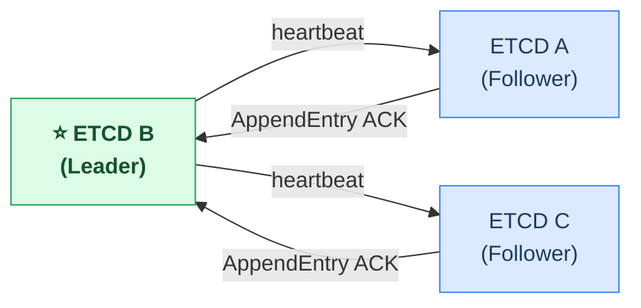

| 구분 | 데이터 | 설명 |
|---|---|---|
| 영속 (디스크) | currentTerm | 현재 선거 회차 |
| 영속 (디스크) | votedFor | 이번 회차에서 내가 찍은 후보 |
| 영속 (디스크) | log[] | 클러스터에 적용된 모든 명령 기록 (멤버 설정 포함) |
| 휘발성 (모든 노드) | commitIndex | 과반수가 복제 완료해서 확정된 마지막 로그 번
호 |
| 휘발성 (모든 노드) | lastApplied | 실제 상태 머신(DB)에 반영된 마지막 로그 번
호 |
| 휘발성 (리더만) | nextIndex[] | 각 follower에게 다음에 보낼 로그 번호 |
| 휘발성 (리더만) | matchIndex[] | 각 follower가 여기까지 받았다고 확인된 로그 번
호 |

<br />
<br />

# ETCD의 장애
etcd는 Kubernetes의 **단일 진실 공급원(single source of truth)**이다.
모든 클러스터 상태가 etcd에 저장되기 때문에, etcd에 문제가 생기면 전체 클러스터에 영향을 준다.

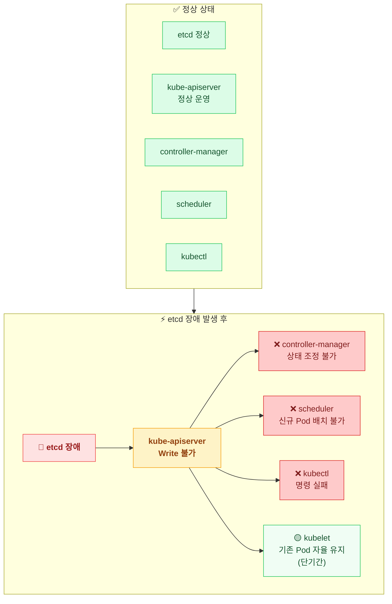

이 글에서는 etcd에서 발생할 수 있는 장애 유형을 시나리오별로 분석하고, etcd의 메모리, 디스크 관리 방법과 백업, 복구 방법까지 함께 정리한다.

<br />
<br />

# 장애 시나리오 분석

etcd 장애는 발생 원인에 따라 크게 **세 계층**으로 나눌 수 있다.

**1. Raft 합의 계층** — 노드 상태나 네트워크 문제로 합의 자체가 흔들리는 경우

**2. 스토리지 계층** — 디스크 문제로 etcd 데이터 저장 자체가 불가해지는 경우

**3. 운영/멤버십 계층** — 클러스터를 구성하거나 노드를 추가/제거하는 과정에서 발생하는 경우


<br />
<br />

## 1. Raft 합의 계층 장애

Raft 합의 계층의 장애는 달성 가능한 Quorom (정족수)가 전체 노드 중 몇 %냐에 따라 다르다.

### 1.1. 소수 Follower 장애 (서비스 영향 없음)

**가장 흔하지만, 클러스터가 알아서 처리하는 유형이다.**

정족수(`(N/2) + 1`) 미만의 Follower가 장애 났을 때다.

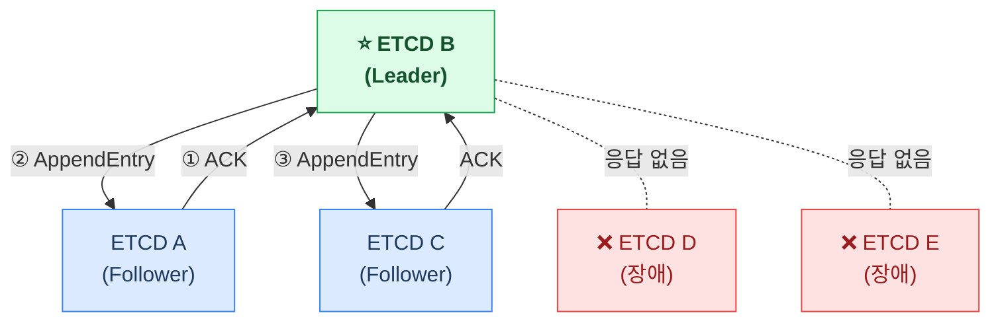

나머지 멤버들이 쿼럼을 유지하므로 **클러스터는 계속 Write 요청을 처리한다.**
kube-apiserver는 장애 난 멤버와의 연결이 끊기지만, **클라이언트 라이브러리가 자동으로 정상 멤버로 재연결**한다.

<br />

### 1.2. 다수 Follower 장애 (Quorom Loss)

정족수(`(N/2) + 1`) 이상의 노드가 동시에 장애 나면 Write가 불가능해진다.

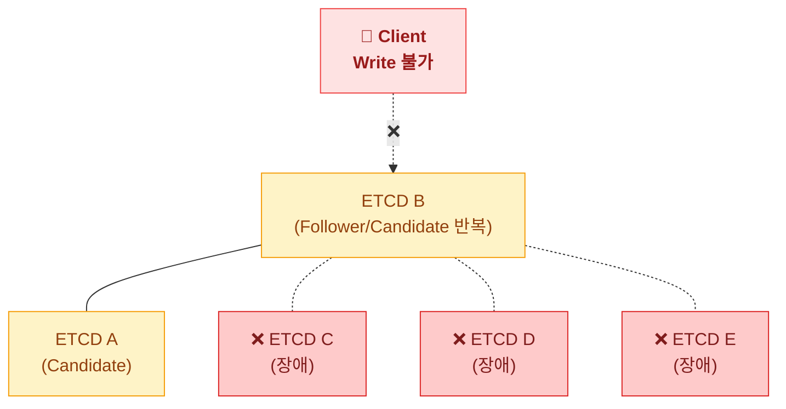

노드 개수에 따른 정속수와 허용 장애 노드 수는 다음과 같다.
위 케이스는 5 nodes에 3대 이상 동시 장애에 해당한다.

| 노드 개수 | 정족수 | 허용 장애 | 쿼럼 손실 조건 |
|-------------|------|---------|-------------|
| 1개 | 1 | 0개 | 1대 장애 |
| 3개 | 2 | 1개 | **2대 이상 동시 장애** |
| 5개 | 3 | 2개 | **3대 이상 동시 장애** |


**증상**
- `etcdctl endpoint status`: 리더 없음, 모든 노드가 follower/candidate 반복
- `etcdctl endpoint health`: `unhealthy: failed to commit proposal`
- `kube-apiserver`: `etcdserver: request timed out, etcdserver: no leader`
- kubectl 명령: 읽기는 캐시로 일부 가능하나, 모든 쓰기(Pod 생성, 삭제, 스케일링
등) 실패

<br />

## 2. Raft 합의 계층 장애 복구
과반수 멤버가 다시 정상화되면 클러스터가 자동으로 새 Leader를 선출하고 정상 복귀한다. 
새 Leader는 모든 lease 타임아웃을 자동으로 연장하여 서버 측 장애로 lease가 만료되지 않도록 보장한다.
과반수 멤버가 복구 불가한 경우에는 스냅샷을 이용한 수동 복원이 필요하다.

<br />

### 2.1. Leader 장애 & 재선출

**Leader node에 장애가 발생하는 경우이다.**

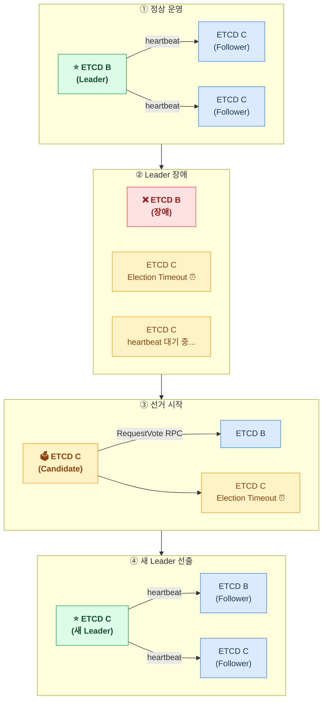

**Leader 선출 소요 시간**: 수백 ms ~ 수 초 (election timeout 기반 감지)

Leader 선출이 완료되기 전까지 [Write 요청은 실패가 아니라 큐에 대기](https://etcd.io/docs/v3.5/op-guide/failures/#leader-failure) 하다가 선출 후 처리된다.

이미 [Commit된 Write는 절대 유실되지 않는다.]((https://etcd.io/docs/v3.5/op-guide/failures/#leader-failure)) **단, Leader 장애 직전에 보낸 Write 중 아직 Commit되지 않은 것은 유실될 수 있다.**

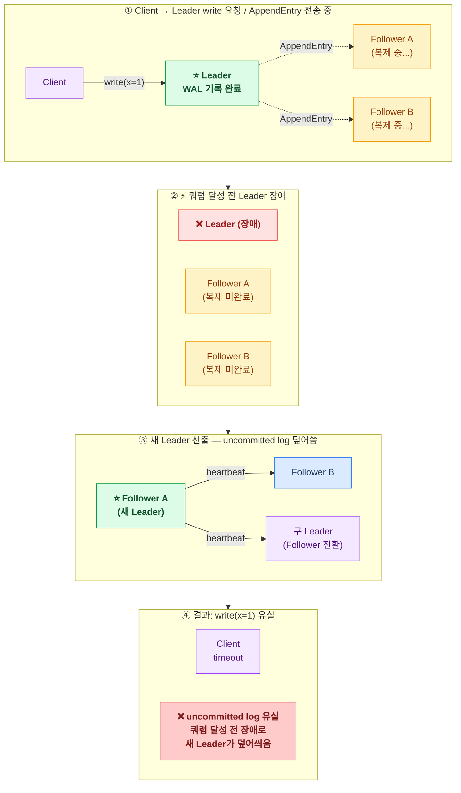

<br />

### 2.2. Follower 장애 & 복구

**Follower node에 장애가 발생하는 경우이다.**

쿼럼 이하의 Follower 장애라면 [클러스터는 계속 정상 운영된다.](https://etcd.io/docs/v3.5/op-guide/failures/#follower-failure) Leader는 장애 난 Follower에게 `AppendEntry`를 계속 시도하고, 나머지 멤버로 쿼럼을 채워 Write를 처리한다.

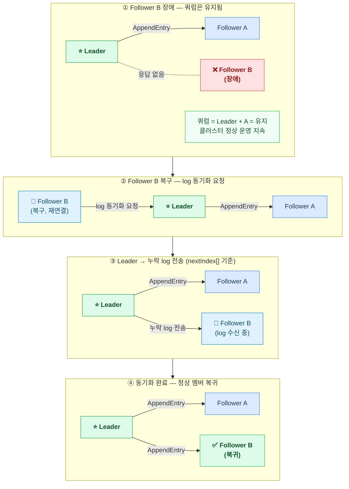

<br />

#### 추가 개념: Split Vote (동시에 Candidate가 되는 경우)

만일 Leader node에 장애가 발생해서 여러 Follower 중 하나가 Leader가 되야하는 상황이라 가정하자. 만일 둘 다 Candidate가 되는 경우에는 어떻게 해야할까 ?

ETCD는 이 문제를 방지하기 위해 Raft 알고리즘의 Election Timeout을 **150ms~300ms 랜덤**으로 설계하였다.
그래서 보통 한 Follower가 먼저 timeout되어 빠르게 리더가 선출된다.
하지만 드물게 **두 Follower가 거의 동시에 timeout되면 Split Vote가 발생**한다.

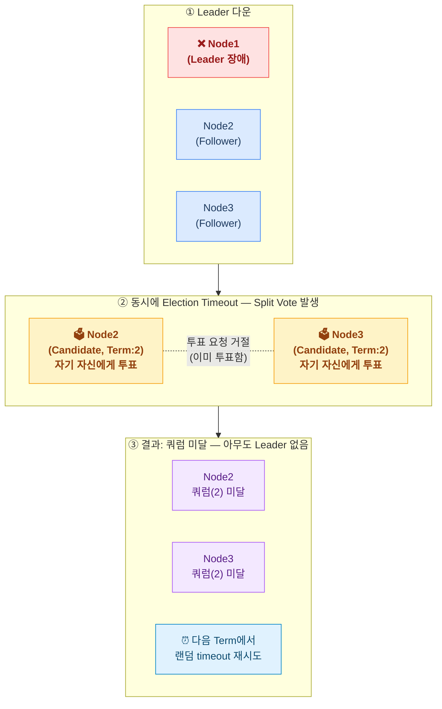

아무도 리더가 되지 못하면, 두 Candidate 모두 다시 **랜덤한 Election Timeout**을 기다린다.
다음 라운드에서 한 쪽이 먼저 timeout되면 상대방이 아직 Follower 상태여서 투표해준다.

| 상황 | 결과 |
|------|------|
| 한 Follower만 먼저 timeout | 빠르게 리더 선출 (일반적) |
| 동시에 timeout (Split Vote) | 이번 Term은 리더 없음 → 다음 Term에서 재시도 |
| Split Vote 반복 | 극히 드묾, 랜덤 timeout이 확률적으로 해소 |

> Split Vote는 **Safety(데이터 일관성)를 깨지 않는다.** 아무도 쿼럼을 달성하지 못했기 때문에 **데이터 Write도 발생하지 않는다.**

<br />
<br />

### 2.3. 운영자가 수동으로 제거하는 경우

etcd에서 멤버 추가/제거는 **Cnew(Configuration New)** 를 통해 이루어진다.
Cnew는 새로운 멤버 구성을 담은 Raft log 엔트리로, 일반 데이터 Write와 동일하게 **쿼럼 합의를 거쳐 commit**된다.
Cnew가 commit되는 순간 클러스터 전체가 새 멤버 구성을 공식 확정한다.

#### 2.3.1. Follower 제거 (일반적인 경우)

`etcdctl member remove <ID>` 명령을 Follower에게 적용하면 해당 멤버를 ETCD Raft에서 제거할 수 있다.

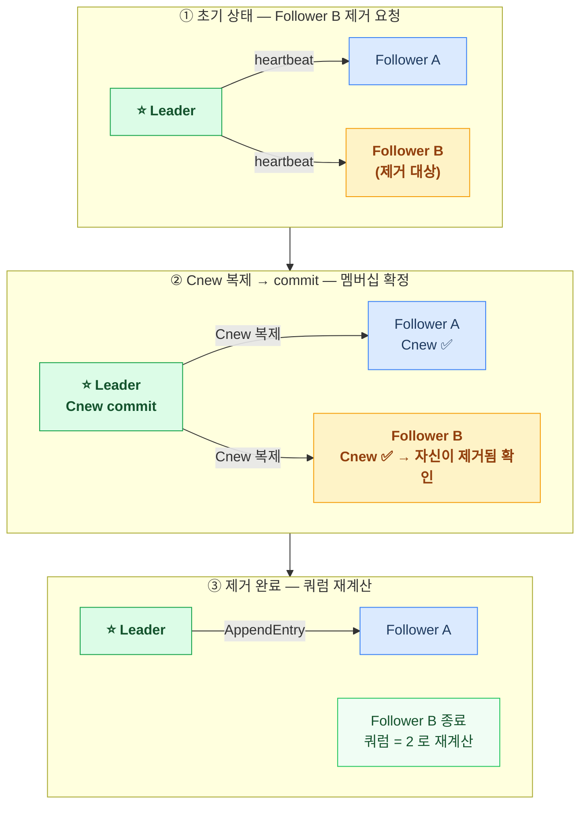

- 제거 대상 Follower가 응답하지 않아도 **나머지 멤버로 쿼럼을 달성하면** 제거가 완료된다.
- 제거 완료 후 클러스터는 줄어든 멤버 수 기준으로 쿼럼을 재계산한다.

**멤버 삭제 제한 (Restriction)**
현재 정상 동작하는 멤버 수(`started`)가 쿼럼보다 작아질 것으로 예상되면, Leader는 [멤버 삭제 요청을 거절](https://tech.kakao.com/posts/484)한다.

<br />

#### 2.3.2. Leader Step Down (Leader 자기 자신 제거)

일반적인 멤버 제거 요청은 log 복제 방식으로 처리된다.
그러나 Leader가 자기 자신을 제거하라는 요청을 받으면 **일반 쿼럼 계산에서 자기 자신을 제외**하고 처리한다.

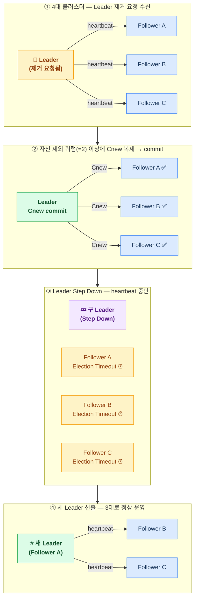

**자기 자신을 제외한 쿼럼으로 복제한 이유**: Step Down 이후에도 나머지 서버 중에서 새 Leader가 반드시 선출될 수 있음을 보장하기 위해서다.

**Step Down 전에 Write 요청을 받으면?**
Config log(Cnew)가 아직 commit되지 않은 상태에서도 자신을 제외한 쿼럼만큼 log replication을 수행한다.
이는 Step Down 이후 새 Leader가 safety를 유지하며 정상 동작할 수 있도록 하기 위한 설계다.

<br />
<br />

### 5. Network Partition (네트워크 파티션)

**네트워크 파티션**은 노드가 죽은 게 아니라, **네트워크 경로가 끊어져 노드들이 서로 통신할 수 없게 쪼개지는 현상**이다.
네트워크 스위치 장애, 방화벽 정책 변경, 클라우드 AZ 간 회선 단절 등이 원인이 된다.

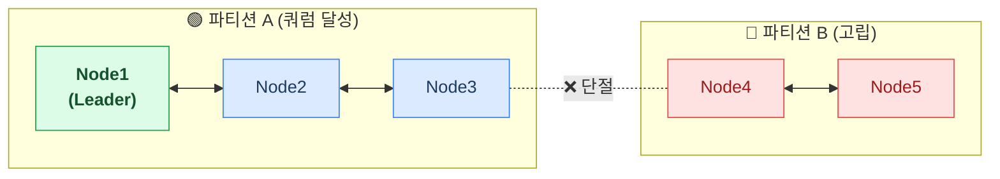

파티션이 위험한 이유는 **Split-Brain** 때문이다.
양쪽 파티션이 각자 "내가 맞다"며 독립적으로 Write를 처리하면, **데이터가 서로 달라지는 일관성 파괴**가 발생한다.

**etcd는 네트워크 파티션에서 Split-Brain이 발생하지 않는다.**

파티션의 동작은 **Leader가 어느 쪽에 있느냐**에 따라 두 가지로 나뉜다.

#### Case A: Leader가 다수 쪽에 있는 경우

```
[Node1 Leader] ←→ [Node2] [Node3]   |   [Node4] [Node5]
        다수 쪽 (쿼럼 달성)                  소수 쪽
```

- 다수 쪽: 쿼럼 유지 → 정상 운영 계속
- 소수 쪽: election timeout → Candidate → 투표 요청 → **쿼럼 미달로 Leader 선출 실패** → Write 불가 대기

#### Case B: Leader가 소수 쪽에 있는 경우

```
[Node1 Leader]   |   [Node2] [Node3] [Node4] [Node5]
    소수 쪽              다수 쪽 (쿼럼 달성)
```

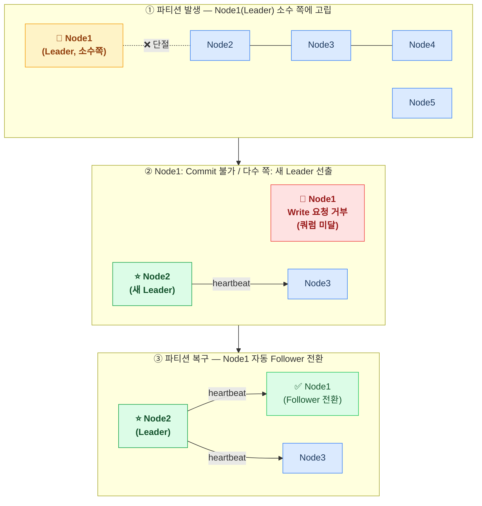

**Split-Brain이 발생하지 않는 이유**: etcd는 **멤버 추가/제거 자체가 과반수 합의를 통해서만 가능**하다.
소수 파티션이 독립적인 클러스터로 분리되는 상황이 구조적으로 차단된다. ([etcd Failure Modes](https://etcd.io/docs/v3.5/op-guide/failures/#network-partition))

**파티션 복구 시**: 소수 쪽(또는 구 Leader)은 **자동으로 다수 쪽의 새 Leader를 인식하고 log를 동기화하며 Follower로 합류**한다. ([etcd Failure Modes](https://etcd.io/docs/v3.5/op-guide/failures/#network-partition))

#### 실무에서 놓치기 쉬운 함정: 방화벽의 silent drop

[Issue #18052](https://github.com/etcd-io/etcd/issues/18052)에서는 방화벽이 etcd 피어 포트(2380)의 패킷을 **조용히 드롭**하는 상황이 보고됐다.
TCP 연결 자체는 `ESTABLISHED` 상태로 보이지만 실제로는 데이터가 전달되지 않는다.
etcd는 이 상황을 빠르게 감지하지 못하고, **약 17분 후에야** 재연결을 시도한다.

이 17분 동안:
- etcd 입장에서는 피어와 "연결은 됐지만 응답이 없는" 상태
- 모니터링 대시보드에는 멤버가 정상으로 표시될 수도 있음
- 실제로는 해당 멤버가 파티션된 것과 동일한 효과

> 네트워크 장비 교체, 보안 정책 변경 후 etcd 피어 통신이 정상인지 반드시 확인해야 한다.
> `etcdctl endpoint health`만으로는 이 상황을 잡아내지 못할 수 있다.

<br />

## 3. 스토리지 계층 장애 복구

**조용히 발전하다 갑자기 터지는 유형이다. 특히 I/O 지연은 리더 재선출의 숨겨진 트리거가 된다.**

| 원인 | 설명 |
|------|------|
| Compaction 미설정 | revision 데이터가 무한 증가 |
| DB 사이즈 쿼터 초과 | etcd 기본 DB 사이즈: 2GB |
| 디스크 I/O 포화 | WAL fsync 지연 → Raft 합의 타임아웃 |
| 다른 프로세스와 디스크 경합 | 컨테이너 로그, Prometheus TSDB 등 |

DB SIZE가 기본 쿼터인 **2GB**에 도달하면 etcd는 `mvcc: database space exceeded` 에러를 반환하며 read-only 모드로 전환된다.

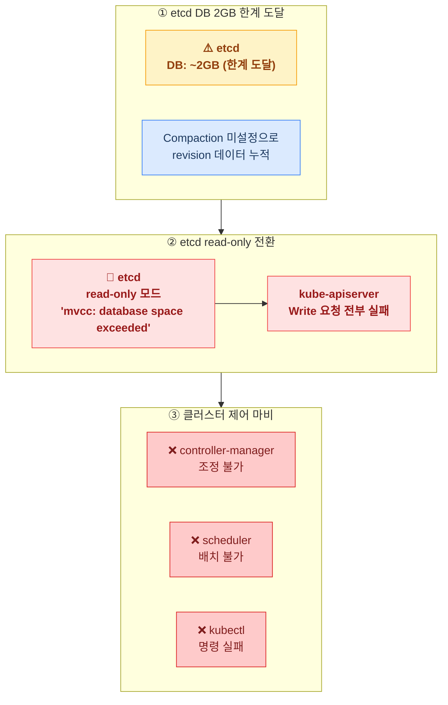

#### I/O 지연이 리더 재선출을 유발하는 경로

디스크가 느려지면 단순히 "etcd가 느려진다"로 끝나지 않는다.
WAL fsync가 지연되면 Leader가 heartbeat를 제때 보내지 못하고, 그 결과로 불필요한 리더 재선출이 발생한다.

[Issue #13648](https://github.com/etcd-io/etcd/issues/13648)에서는 Pod 약 50개, 초당 7개 key 변경이라는 **매우 낮은 부하**의 클러스터에서도 I/O 경합으로 인해 `Range request took too long`, WAL 타임아웃, 리더 재선출이 연쇄적으로 발생한 사례가 보고됐다.

더 심각한 케이스가 [Issue #15247](https://github.com/etcd-io/etcd/issues/15247)이다.
Leader가 `fdatasync`에 묶이면서 heartbeat를 놓쳐 리더십을 잃었고, 이 과정에서 **클러스터의 모든 lease가 일괄 revoke**됐다.
분산 락, 서비스 등록 등 lease 기반 기능을 사용하는 애플리케이션이 동시에 전부 영향을 받는 상황이다.

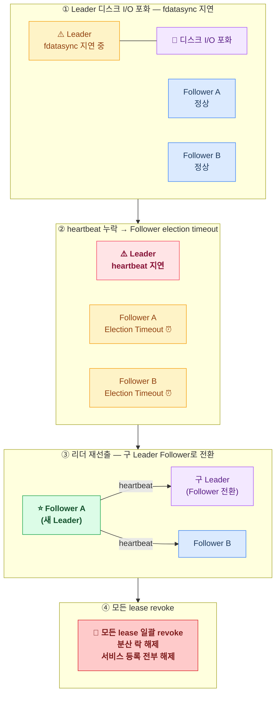

> etcd는 **control plane과 동일한 디스크를 사용하지 않는 것**이 권장된다.
> SSD, 가능하면 전용 디스크를 쓰는 이유가 여기 있다.


대응 방법은 아래 **Compaction & Defragmentation** 섹션에서 다룬다.

<br />

#### 복구 중 발생하는 추가 부하

장애 멤버가 복구되면 Leader로부터 누락된 log를 동기화한다.
이 과정이 생각보다 위험하다.

etcd는 snapshot-count(기본 100,000 entries) 이상이 쌓이면 메모리의 log를 파일로 truncate한다.
장애 중 이미 truncate된 구간이 있으면, Leader는 **log 대신 snapshot 파일 전체를 복구 멤버에게 전송**해야 한다.

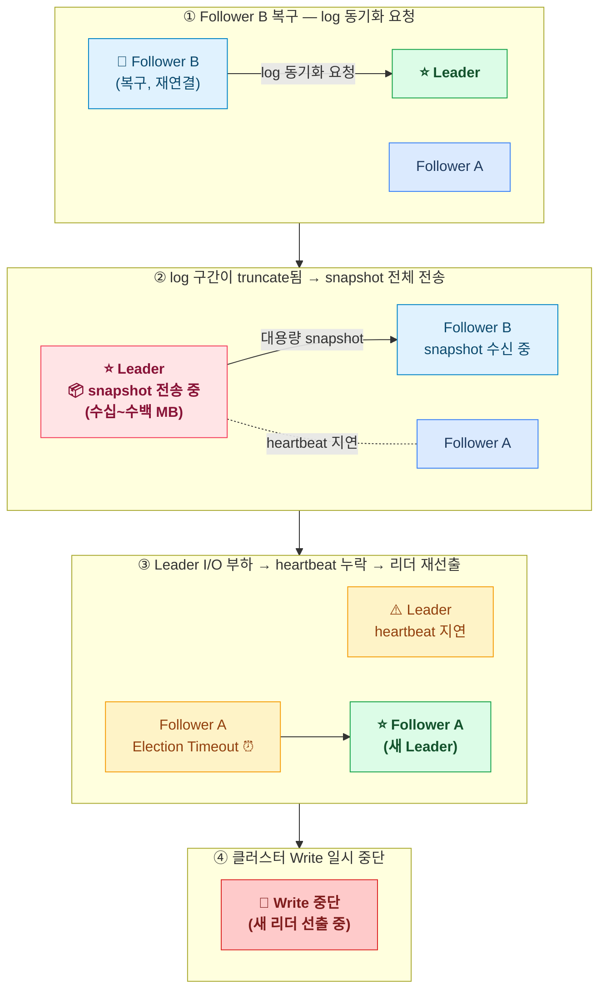

이 cascade는 etcd 공식 문서([Learner 설계 문서](https://etcd.io/docs/v3.3/learning/learner/))에 명시된 실제 문제다.
GitHub issue [#13913](https://github.com/etcd-io/etcd/issues/13913)에서는 DB 크기가 35MB 이상인 클러스터에서 Follower 복구 중 대형 snapshot 전송으로 인해 **Leader가 heartbeat를 놓쳐 의도치 않은 리더 재선출이 반복**된 사례가 보고됐다.
Issue [#2662](https://github.com/etcd-io/etcd/issues/2662)에서는 Follower 복구 중 Leader의 메모리가 **최대 40배**까지 치솟은 케이스도 있다.

#### 실제 사례: 멤버 교체가 control plane을 다운시킨 경우

[실제 운영 포스트모텀](https://medium.com/@truonghongcuong68/when-etcd-collapses-how-a-single-node-replacement-took-down-my-kubernetes-control-plane-f913eec825cd)에서 다음 순서로 장애가 발생했다:

1. etcd 멤버 1대 교체 → 신규 멤버 기동 → snapshot 동기화 시작
2. 대형 snapshot 전송으로 Leader 네트워크 포화
3. Leader → 나머지 Follower heartbeat 누락 → 리더 재선출
4. 구 멤버는 제거됐고 신규 멤버는 아직 동기화 중 → **쿼럼 손실**
5. control plane 전체 다운

"Follower 1대 교체"가 "control plane 전체 장애"로 번진 케이스다.
**멤버를 교체할 때는 etcd DB 크기를 먼저 확인하고, 가능하면 Compaction + Defrag 후 진행해야 한다.**

#### 또 다른 함정: 느린 Follower

장애까지 가지 않더라도, Follower의 디스크 I/O가 느리면 클러스터 전체 Write 지연이 증가할 수 있다.
[Issue #14501](https://github.com/etcd-io/etcd/issues/14501)에서는 단일 Follower의 fsync 지연이 **클러스터 전체 Write latency를 끌어올린** 사례가 보고됐다.
심한 경우 "slow follower livelock"이 발생한다 — Follower가 snapshot을 받는 속도보다 쓰기가 더 빠르게 쌓여 영원히 따라잡지 못하는 상태다.


---

### 7. WAL / 데이터 손상 (Corruption)

**가장 드물지만 복구가 어려운 유형이다.**

**발생 원인**:
- 노드 강제 종료 중 WAL fsync 미완료
- 스토리지 하드웨어 장애 (bad sector)
- 잘못된 etcd 버전 다운그레이드

etcd가 기동 시 다음과 같은 에러를 출력하고 시작을 거부한다:

```
wal: crc mismatch
mvcc: db file is corrupt
```

3대 클러스터 기준, 1대가 손상되면 나머지 2대로 쿼럼을 유지하면서 손상된 멤버를 교체한다.

```bash
# 1. 손상된 멤버 제거
etcdctl member remove <member-id>

# 2. 해당 노드의 etcd 데이터 디렉토리 삭제
rm -rf /var/lib/etcd/

# 3. 기존 클러스터에 새 멤버로 재가입
etcdctl member add <new-member-name> --peer-urls=<peer-url>

# 4. etcd 재시작 (INITIAL_CLUSTER_STATE=existing 으로 설정)
```

<br />

---

### 9. 신규 멤버 추가 시 발생하는 문제

**"노드 추가"는 단순한 작업처럼 보이지만, etcd 클러스터 입장에서는 쿼럼 크기 자체가 바뀌는 위험한 순간이다.**

#### 문제 1: 신규 멤버가 Leader를 과부하시키는 경우

신규 멤버는 데이터가 전혀 없는 상태로 시작한다.
Leader로부터 모든 log를 받아야 하는데, 장애 기간이 길수록 받아야 할 양이 많아지고, 이미 truncate된 구간은 snapshot 전체를 전송받아야 한다.

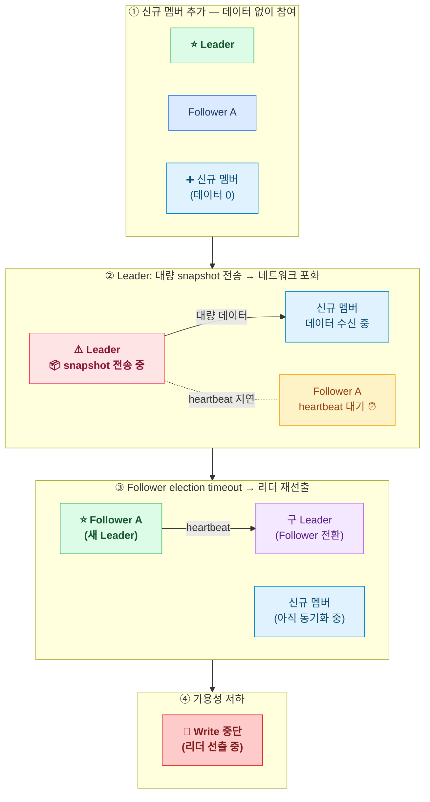

이 문제는 etcd 공식 [Learner 설계 문서](https://etcd.io/docs/v3.3/learning/learner/)에 명시된 내용이다.
앞서 다룬 "Follower 복구 중 Leader 과부하" 케이스와 동일한 메커니즘이지만, 신규 멤버는 Follower 복구보다 **따라잡아야 할 양이 더 많다**.

<br />

#### 문제 2: 신규 멤버 추가 후 네트워크 파티션이 발생하는 경우

신규 멤버가 추가되면 **클러스터 크기와 쿼럼이 바뀐다.**
이 타이밍에 네트워크 파티션이 발생하면 예상치 못한 결과가 나온다.

**Case: 3대 클러스터에 1대 추가 → 총 4대 (쿼럼=3)**

| 파티션 구성 | 결과 |
|-----------|------|
| 3+1 (Leader가 3쪽) | 쿼럼 3 유지 → 정상 운영 |
| 2+2 | **양쪽 모두 쿼럼(3) 미달 → 리더 선출 불가** |

기존 3대일 때는 2+1 파티션이어도 2쪽에서 쿼럼을 유지할 수 있었지만,
4대 클러스터에서 2+2로 갈리면 양쪽 모두 쿼럼이 없어 **클러스터 전체가 마비**된다.

```
기존 3대: 쿼럼=2 → 2+1 분리 시 2쪽이 쿼럼 유지 (정상 운영)
신규 추가 후 4대: 쿼럼=3 → 2+2 분리 시 어느 쪽도 쿼럼 미달
```

<br />

#### 문제 3: 파티션 먼저, 멤버 추가 나중

더 위험한 케이스다.
이미 파티션이 발생해 3대 중 Follower 1대가 단절된 상태에서 신규 멤버를 추가하면:

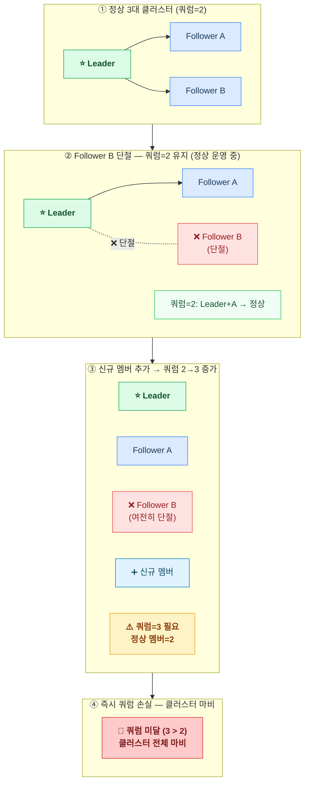

**이 때문에 `member add` 전에 반드시 단절된 멤버를 `member remove`로 먼저 제거해야 한다.**
"장애 노드를 교체할 때는 remove → add 순서"가 etcd의 공식 권장이다. ([etcd Learner 설계 문서](https://etcd.io/docs/v3.3/learning/learner/))

<br />

#### 문제 4: 잘못된 peer URL로 멤버 추가

`etcdctl member add` 명령은 peer URL의 유효성을 검증하지 않고 즉시 적용된다.
잘못된 URL이 추가되면 신규 etcd 프로세스 자체가 기동되지 못하고, 이미 쿼럼이 바뀐 상태가 된다.

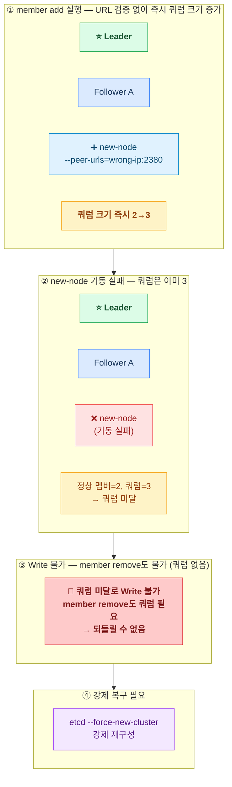

잘못된 멤버 추가 하나가 클러스터 전체를 불능 상태로 만들 수 있다.

<br />

#### 해결책: Learner 노드 활용 (etcd v3.4+)

위 문제들을 근본적으로 해결하기 위해 etcd v3.4부터 **Learner** 상태가 도입됐다.

Learner는 **투표권 없이 클러스터에 참여**하는 비투표 멤버다.
쿼럼 크기에 영향을 주지 않으면서 Leader의 log를 복제받아 따라잡을 수 있다.

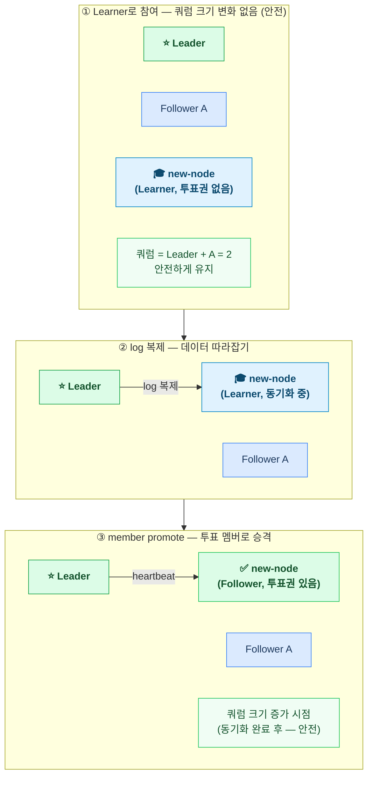

| 항목 | 기존 방식 | Learner 방식 |
|------|---------|------------|
| 쿼럼 변화 시점 | `member add` 즉시 | `member promote` 시점 |
| 데이터 없이 참여 | 즉시 투표 참여 | 투표권 없이 동기화 먼저 |
| 잘못된 URL 추가 | 클러스터 마비 가능 | 쿼럼 영향 없음 (언제든 제거 가능) |
| Leader 과부하 | 즉시 발생 가능 | 제한된 속도로 복제 |

> Learner는 리더가 될 수 없고, 클라이언트 read/write 요청을 처리하지 않는다.
> 동기화가 완료됐는지 확인 후 수동으로 `member promote`를 실행해야 한다.

<br />
<br />

## etcd 운영 관리

장애를 예방하려면 etcd가 메모리와 디스크를 어떻게 사용하는지 이해해야 한다.

### Log Retention (로그 보존)

etcd는 **log entry를 메모리에 보관**한다.
모든 log를 영구적으로 메모리에 쌓으면 OOM이 발생하기 때문에, 주기적으로 **스냅샷을 생성하고 메모리를 비운다(truncate)**.

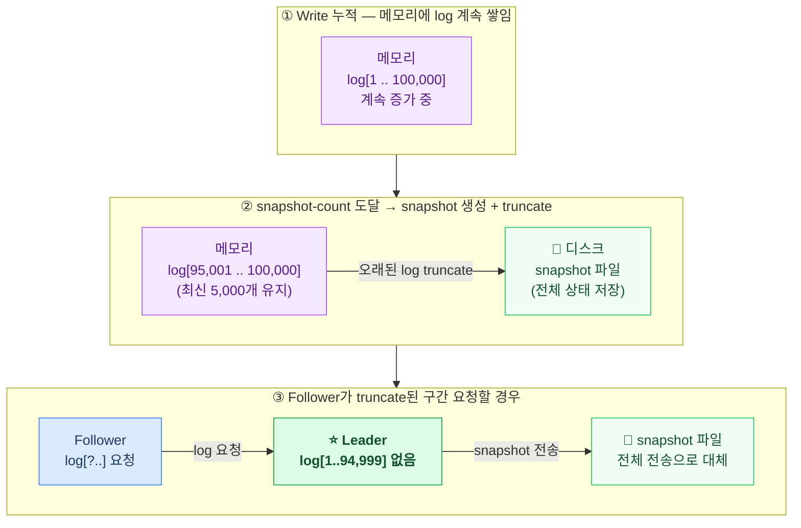

만약 특정 Follower의 log 따라잡기 속도가 너무 느려서 Leader 메모리에 없는 log를 요구하면, Leader는 **최근 snapshot 파일을 Follower에게 전송**한다. ([kakao tech — etcd 기본 동작 원리](https://tech.kakao.com/posts/484))

> `snapshot-count` 옵션으로 스냅샷 주기를 조절할 수 있다. 값을 낮추면 메모리를 더 자주 비우지만 snapshot I/O가 증가한다.

<br />

### Revision & Compaction

etcd는 하나의 key에 대한 **모든 변경사항을 파일시스템에 기록**한다. 이것을 revision이라고 한다.

```
key "x"에 대한 write 이력:

revision 3: x = "apple"
revision 7: x = "banana"
revision 12: x = "cherry"   ← 현재 최신
```

이 구조 덕분에 특정 시점의 데이터를 조회할 수 있지만, 별도 관리 없이 계속 쌓이면 디스크 공간이 고갈된다.
**Compaction**으로 오래된 revision을 삭제할 수 있으며, 삭제된 revision은 더 이상 조회할 수 없다.

#### Auto Compaction

etcd는 두 가지 Auto Compaction 모드를 제공한다. ([etcd 공식 운영 가이드 — Auto Compaction](https://etcd.io/docs/v3.5/op-guide/maintenance/#auto-compaction))

**Revision 모드**: 5분마다 `최신 revision - retention 값` 이하를 삭제

```
auto-compaction-mode: revision
auto-compaction-retention: 1000

→ 5분마다 (최신 revision - 1000) 이전 데이터 삭제
  현재 revision이 5000이면 → 4000 이하 삭제
```

**Periodic 모드**: 지정한 시간 단위로 삭제

```
auto-compaction-mode: periodic
auto-compaction-retention: 8h

→ 8h를 10으로 나눈 1h 단위로 compaction
  1시간마다 1시간 전 revision 이하 삭제
```

<br />

### Defragmentation (단편화 제거)

Compaction으로 revision을 삭제해도 **파일시스템의 디스크 공간이 자동으로 반환되지 않는다.**
RDB에서 DELETE를 해도 디스크 공간이 확보되지 않는 것과 같은 원리다.
Defragmentation을 해야 단편화를 정리하고 디스크 공간을 실제로 확보할 수 있다. ([kakao tech — etcd 기본 동작 원리](https://tech.kakao.com/posts/484))

| 항목 | Compaction | Defragmentation |
|------|-----------|----------------|
| 목적 | 오래된 revision 논리적 삭제 | 디스크 공간 실제 반환 |
| 자동화 | 가능 (auto compaction) | **없음 (수동만 가능)** |
| 처리 중 영향 | 없음 | **해당 멤버 read/write 일시 block** |
| block 시간 | - | 보통 수 ms (DB 크기에 따라 다름) |

```bash
# 1. 현재 revision 확인
CURRENT_REV=$(etcdctl endpoint status --write-out="json" \
  | jq '.[] | .Status.header.revision')

# 2. Compaction (오래된 revision 정리)
etcdctl compact $CURRENT_REV

# 3. Defrag (디스크 공간 실제 반환)
#    한 번에 하나씩 순서대로 진행 (멤버별 순차 실행 권장)
etcdctl defrag --endpoints=<etcd-endpoint>

# 4. DB 사이즈 확인
etcdctl endpoint status --write-out=table
```

**DB 사이즈 쿼터**:
- 기본값: **2GB** (`etcd_quota_backend_bytes`)
- 최대값: **8GB**
- 2GB 초과 시 read-only 모드로 전환 (Write 전부 거부)

DB 사이즈가 증가 추세라면 Compaction + Defrag 주기를 설정하거나, 쿼터를 늘려 가용성 문제가 생기지 않도록 해야 한다.

<br />
<br />

## etcd 백업과 복구

### 스냅샷 백업

etcd 복구의 기본은 **주기적인 스냅샷 백업**이다.

```bash
etcdctl snapshot save /backup/etcd-snapshot-$(date +%Y%m%d%H%M).db \
  --endpoints=https://127.0.0.1:2379 \
  --cacert=/etc/kubernetes/pki/etcd/ca.crt \
  --cert=/etc/kubernetes/pki/etcd/healthcheck-client.crt \
  --key=/etc/kubernetes/pki/etcd/healthcheck-client.key

# 스냅샷 상태 확인
etcdctl snapshot status /backup/etcd-snapshot.db --write-out=table
```

**`etcdctl snapshot save`와 단순 파일 복사의 차이** ([kakao tech — etcd 기본 동작 원리](https://tech.kakao.com/posts/484)):
- `etcdctl snapshot save`로 만든 파일에는 **무결성 해시(hash)가 포함**된다.
- `etcdctl snapshot restore` 시 파일 변조 여부를 자동으로 검증한다.
- 단순 복사로 만든 파일로 복구할 때는 `--skip-hash-check` 옵션이 필요하다.

또한 Compaction과 Defrag를 수행한 후 백업하면, 불필요한 revision 데이터가 제거되어 **백업 파일 크기를 줄일 수 있다.**

<br />

### 스냅샷 복구 (Quorum Loss 대응)

쿼럼을 복구할 수 없을 때 스냅샷으로 클러스터를 복원한다.

```bash
# 1. kube-apiserver 중지
#    /etc/kubernetes/manifests/kube-apiserver.yaml 임시 이동

# 2. 기존 etcd 데이터 백업
mv /var/lib/etcd /var/lib/etcd.bak

# 3. 스냅샷으로 데이터 복원
etcdctl snapshot restore /backup/etcd-snapshot.db \
  --name=<member-name> \
  --initial-cluster=<member-name>=https://<ip>:2380 \
  --initial-advertise-peer-urls=https://<ip>:2380 \
  --data-dir=/var/lib/etcd

# 4. etcd 재시작

# 5. kube-apiserver 복구
#    /etc/kubernetes/manifests/kube-apiserver.yaml 복원
```

**복구 시 새로운 클러스터 메타데이터 사용이 중요하다.**

etcd 메타데이터에는 클러스터 UUID와 멤버 UUID가 저장된다.
이전 메타데이터를 그대로 사용하면, 장애 났던 서버가 다시 살아날 경우 충돌이 발생할 수 있다.
`etcdctl snapshot restore` 명령은 자동으로 새 클러스터 메타데이터를 생성하므로, 단순 파일 복사가 아닌 이 명령을 사용해야 한다. ([kakao tech — etcd 기본 동작 원리](https://tech.kakao.com/posts/484))

> kubeadm 클러스터에서는 `/etc/kubernetes/manifests/` 아래 Static Pod manifest를 이동시키는 것으로 컴포넌트를 중지/재시작할 수 있다.

<br />

### 자동 백업 구성 권장

수동 백업은 누락될 수 있다. **CronJob으로 주기적 백업을 자동화**하는 것을 권장한다.

```yaml
# etcd-backup-cronjob.yaml (예시)
apiVersion: batch/v1
kind: CronJob
metadata:
  name: etcd-backup
  namespace: kube-system
spec:
  schedule: "0 2 * * *"   # 매일 새벽 2시
  jobTemplate:
    spec:
      template:
        spec:
          hostNetwork: true
          containers:
          - name: etcd-backup
            image: bitnami/etcd:latest
            command:
            - /bin/sh
            - -c
            - |
              etcdctl snapshot save /backup/etcd-$(date +%Y%m%d).db
              # 오래된 백업 삭제 (5일치 유지)
              find /backup -name "etcd-*.db" -mtime +5 -delete
            env:
            - name: ETCDCTL_API
              value: "3"
            - name: ETCDCTL_ENDPOINTS
              value: "https://127.0.0.1:2379"
            # cacert, cert, key 마운트 필요
          restartPolicy: OnFailure
```

주요 고려사항:
- 모든 클러스터가 동시에 백업하면 네트워크 부하가 집중된다. 클러스터마다 다른 시간을 설정하는 것이 좋다.
- 백업 파일은 오브젝트 스토리지(S3 등)에 저장하여 노드 장애에도 안전하게 보존한다.
- 백업 전 Compaction + Defrag를 수행하면 백업 크기를 줄일 수 있다.

<br />
<br />

## 모니터링 지표 정리

| 메트릭 | 설명 | 임계값 |
|--------|------|--------|
| `etcd_server_has_leader` | 리더 존재 여부 | `== 0` 이면 Alert |
| `etcd_server_leader_changes_seen_total` | 리더 변경 횟수 | 1시간에 3회 이상이면 이상 징후 |
| `etcd_server_proposals_failed_total` | 합의 실패 횟수 | 증가 추세이면 Alert |
| `etcd_disk_wal_fsync_duration_seconds` | WAL fsync 지연 | p99 > 10ms 이상이면 경고 |
| `etcd_disk_backend_commit_duration_seconds` | BoltDB commit 지연 | p99 > 25ms 이상이면 경고 |
| `etcd_mvcc_db_total_size_in_bytes` | DB 사이즈 | 쿼터의 80% 초과 시 경고 |
| `etcd_network_peer_round_trip_time_seconds` | 피어 간 RTT | p99 > 100ms 이상이면 경고 |

I/O 지연 지표(`wal_fsync`, `backend_commit`)는 단순 장애 감지를 넘어 **하드웨어 성능 저하나 디스크 경합의 조기 신호**로 활용할 수 있다.

<br />
<br />

## 장애 시나리오 요약

| # | 시나리오 | 자동 복구 | 서비스 영향 | 핵심 대응 |
|---|---------|---------|-----------|---------|
| 1 | 소수 Follower 장애 | 가능 (자동 재연결) | 없음 (부하 증가) | 빠른 복구로 쿼럼 여유 유지 |
| 2 | Quorum Loss | 과반수 복구 시 자동 | 클러스터 제어 전체 마비 | 노드 복구 또는 스냅샷 복원 |
| 3 | Leader 장애 | 가능 (수 초 내 재선출) | Write 큐 대기, uncommitted 유실 가능 | 모니터링으로 반복 여부 확인 |
| 4 | Leader Step Down | 가능 (자동 새 Leader 선출) | 수 초 Write 중단 | 멤버 제거 restriction 확인 |
| 5 | Network Partition | 가능 (파티션 복구 시 자동) | 소수 파티션 Write 불가 | 네트워크 복구 |
| 6 | 디스크 고갈 | 불가 | Write 거부 → 제어 마비 | Compaction + Defrag |
| 7 | WAL / 데이터 손상 | 부분 (멤버 재가입) | 개별 멤버 기동 불가 | 멤버 제거 후 재가입 |
| 8 | 부트스트랩 중 장애 | 불가 | 클러스터 구성 자체 실패 | 데이터 디렉토리 초기화 후 재구성 |
| 9 | 신규 멤버 추가 | 상황에 따라 다름 | Leader 과부하 / 쿼럼 손실 / 마비 | remove → add 순서 준수, Learner 활용 |

<br />
<br />

## 핵심 정리

- etcd 장애는 단독으로 끝나지 않는다. **kube-apiserver → controller-manager → scheduler** 순으로 연쇄 마비된다.
- 기존 Running Pod는 kubelet이 유지하지만, **복구·배포·스케일링이 전부 불가**해진다.
- **소수 Follower 장애와 Leader 재선출은 자동 복구**된다. 반복 발생 여부를 모니터링해 근본 원인을 파악하는 것이 중요하다.
- **Network Partition은 Split-Brain을 일으키지 않는다.** 멤버십 변경이 항상 과반수 합의를 통해서만 가능한 구조이기 때문이다.
- Leader 장애 중 Write 요청은 실패가 아니라 **큐에 대기**한다. 단, Commit 전에 장애 난 uncommitted write는 유실될 수 있다.
- **Compaction은 논리적 삭제, Defragmentation은 실제 디스크 반환**이다. Compaction만으로는 디스크 공간이 확보되지 않는다.
- **스냅샷 복구 시 새 클러스터 메타데이터를 사용해야 한다.** 이전 UUID를 유지하면 구 서버 복구 시 충돌이 발생할 수 있다.
- 가장 중요한 예방책은 **홀수 구성(3대 이상) + 자동 스냅샷 백업 + DB 사이즈 모니터링**이다.

<br />
<br />

| 계층 | 시나리오 | 자동 복구 |
|------|---------|---------|
| **Raft 합의** | 소수 Follower 장애 | 가능 |
| | Quorum Loss | 과반수 복구 시 가능 |
| | Leader 장애 & 재선출 | 가능 |
| | Leader Step Down | 가능 |
| | Network Partition | 가능 |
| **스토리지** | 디스크 고갈 / I/O 지연 | 불가 |
| | WAL / 데이터 손상 | 부분 |
| **운영/멤버십** | 부트스트랩 중 장애 | 불가 |
| | 신규 멤버 추가 문제 | 상황에 따라 다름 |


## 참고 자료

- [etcd 공식 운영 가이드](https://etcd.io/docs/v3.5/op-guide/)
- [etcd Failure Modes 공식 문서](https://etcd.io/docs/v3.5/op-guide/failures/)
- [etcd 재해 복구](https://etcd.io/docs/v3.5/op-guide/recovery/)
- [etcd Learner 설계 문서 — 멤버십 재구성 문제 및 Learner 도입 배경](https://etcd.io/docs/v3.3/learning/learner/)
- [Kubernetes etcd 백업](https://kubernetes.io/docs/tasks/administer-cluster/configure-upgrade-etcd/#backing-up-an-etcd-cluster)
- [kakao tech Kubernetes 운영을 위한 etcd 기본 동작 원리의 이해](https://tech.kakao.com/posts/484)
- [GitHub #13913 — Large snapshots cause missed leader heartbeats](https://github.com/etcd-io/etcd/issues/13913)
- [GitHub #2662 — 40x memory overhead on leader when recovering dead follower](https://github.com/etcd-io/etcd/issues/2662)
- [GitHub #14501 — Slow follower degrading overall write latency](https://github.com/etcd-io/etcd/issues/14501)
- [GitHub #13648 — High I/O load causes range errors and leader re-elections](https://github.com/etcd-io/etcd/issues/13648)
- [GitHub #15247 — All leases revoked when leader stuck in fdatasync](https://github.com/etcd-io/etcd/issues/15247)
- [GitHub #18052 — Broken TCP connection causes ~17-minute reconnect delay](https://github.com/etcd-io/etcd/issues/18052)
- [Postmortem — When etcd Collapses: Single Node Replacement Took Down Kubernetes Control Plane](https://medium.com/@truonghongcuong68/when-etcd-collapses-how-a-single-node-replacement-took-down-my-kubernetes-control-plane-f913eec825cd)
