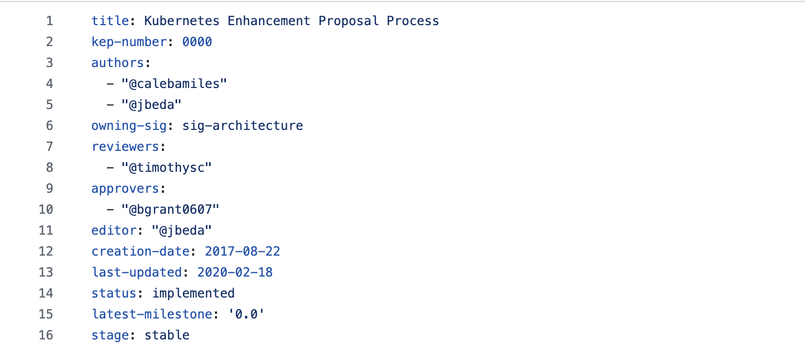

## 테스트 환경

3 Node Stacked ETCD 구성에서 멤버 삭제/추가, Leader 재선출 시나리오를 테스트했다.


### 사전 준비 — 환경 변수 설정

```bash
# etcd pod 이름 확인
kubectl get pod -n kube-system | grep etcd

# 전체 클러스터 상태 조회
kubectl exec -it etcd-porthos-vnl-pub-kr1-dop-rl-cp-1 -n kube-system -- \
  etcdctl \
  --cacert=/etc/kubernetes/pki/etcd/ca.crt \
  --cert=/etc/kubernetes/pki/etcd/server.crt \
  --key=/etc/kubernetes/pki/etcd/server.key \
  --endpoints=https://192.168.1.91:2379,https://192.168.1.56:2379,https://192.168.1.16:2379 \
  endpoint status --write-out=table

# 개별 노드 조회 (cp-1)
kubectl exec -it etcd-porthos-vnl-pub-kr1-dop-rl-cp-1 -n kube-system -- \
  etcdctl \
  --cacert=/etc/kubernetes/pki/etcd/ca.crt \
  --cert=/etc/kubernetes/pki/etcd/server.crt \
  --key=/etc/kubernetes/pki/etcd/server.key \
  --endpoints=https://127.0.0.1:2379 \
  endpoint status --write-out=table
```

### 초기 상태



| 항목 | 값 |
|---|---|
| Leader | cp-1 |
| DB Size | 230 MB |
| RAFT TERM | 41 (Leader 선출이 41회 발생) |

---

## 시나리오 1 — 멤버 삭제

cp-3의 member ID `c302c00356f1848a`를 클러스터에서 제거했다.


### Quorum 유지 확인


2/3 노드가 정상이므로 Quorum은 유지됐다. 단, `kubectl` 응답 latency가 증가했다.

### 발생한 현상

1. **kubectl 일시 hang** — member remove 직후 kube-apiserver가 etcd 엔드포인트를 재협상하는 타이밍에 요청이 끼면 수 초간 응답이 없다.

2. **watch 화면 깜빡임** — endpoint status 조회 자체가 etcd에 read 요청을 보내는데, 멤버 재구성 중 Leader가 잠깐 응답을 못 하는 순간이 watch 화면의 깜빡임으로 나타난다.

3. **cp-1 재시작** — member remove 후 cp-1의 AGE가 초기화됐다. etcd가 멤버 구성 변경을 WAL에 기록하고 재시작한 것으로, 정상 동작이다.

---

## 시나리오 2 — 멤버 추가

### 클러스터에 멤버 등록

```bash
kubectl exec -it etcd-porthos-vnl-pub-kr1-dop-rl-cp-1 -n kube-system -- \
  etcdctl \
  --cacert=/etc/kubernetes/pki/etcd/ca.crt \
  --cert=/etc/kubernetes/pki/etcd/server.crt \
  --key=/etc/kubernetes/pki/etcd/server.key \
  --endpoints=https://192.168.1.91:2379 \
  member add porthos-vnl-pub-kr1-dop-rl-cp-3 \
  --peer-urls=https://192.168.1.16:2380
```

출력 결과:

```
ETCD_NAME="porthos-vnl-pub-kr1-dop-rl-cp-3"
ETCD_INITIAL_CLUSTER="porthos-vnl-pub-kr1-dop-rl-cp-1=https://192.168.1.91:2380,porthos-vnl-pub-kr1-dop-rl-cp-2=https://192.168.1.56:2380,porthos-vnl-pub-kr1-dop-rl-cp-3=https://192.168.1.16:2380"
ETCD_INITIAL_ADVERTISE_PEER_URLS="https://192.168.1.16:2380"
ETCD_INITIAL_CLUSTER_STATE="existing"
```


member add 직후 cp-3은 `unstarted` 상태다. 멤버 등록만 됐을 뿐 etcd 프로세스가 아직 없는 상태로, 이 시점부터 **쿼럼 기준이 3으로 증가**한다.

### cp-3 데이터 초기화 후 재기동

기존 데이터를 삭제하지 않으면 디스크에 남은 이전 member ID와 클러스터에 등록된 새 ID가 충돌해 CrashLoopBackOff가 발생한다.

```json
{
  "msg": "rejected Raft message to mismatch member",
  "local-member-id": "c302c00356f1848a",
  "mismatch-member-id": "f383bce7688605f2"
}
```

데이터 디렉터리를 초기화한다.

```bash
sudo rm -rf /var/lib/etcd && sudo mkdir -p /var/lib/etcd && sudo chmod 700 /var/lib/etcd
```

삭제 후 kubelet이 etcd를 재기동하면 Leader가 즉시 snapshot 전송을 시작한다.

### 대형 snapshot 전송 확인 (Issue #13913)

```bash
kubectl logs etcd-porthos-vnl-pub-kr1-dop-rl-cp-1 -n kube-system | \
  grep -E "sending snapshot|sent database snapshot"
```

```json
{"msg":"sending database snapshot","snapshot-index":15995741,"remote-peer-id":"a30526f5dacd19af","size":"230 MB"}
{"msg":"sent database snapshot","snapshot-index":15995741,"remote-peer-id":"a30526f5dacd19af","size":"230 MB"}
```

230 MB snapshot이 약 2초 만에 전송됐다. I/O 경합이 있는 환경에서는 이 구간이 수십 초로 늘어나 heartbeat 누락 → 리더 재선출로 이어진다. 현재 클러스터의 **RAFT TERM 41**이 그 흔적이다.

---

## 시나리오 3 — Leader 강제 종료 및 재선출

### Leader 삭제

```bash
kubectl delete pod etcd-porthos-vnl-pub-kr1-dop-rl-cp-1 -n kube-system --grace-period=0 --force
```

### 결과 — 1초 내 복구, RAFT TERM 증가


Leader(cp-1)가 종료되자 나머지 Follower들이 election timeout을 감지하고 새 Leader를 선출했다. **RAFT TERM이 42로 증가**한 것이 그 증거다.

cp-1은 Static Pod이므로 kubelet이 즉시 재기동시켰고, 새 Leader로부터 heartbeat를 수신하자 자동으로 Follower로 전환됐다.

### 로그 확인

```bash
kubectl logs etcd-porthos-vnl-pub-kr1-dop-rl-cp-2 -n kube-system | \
  grep -E "became leader|elected leader" | tail -5
```

```json
{"level":"info","ts":"2026-03-27T23:58:05.750027Z","logger":"raft","caller":"etcdserver/zap_raft.go:77","msg":"b9933c48f2424f14 became leader at term 42"}
{"level":"info","ts":"2026-03-27T23:58:05.750042Z","logger":"raft","caller":"etcdserver/zap_raft.go:77","msg":"raft.node: b9933c48f2424f14 elected leader b9933c48f2424f14 at term 42"}
```

### 주의 사항

> Leader 장애 직전, 쿼럼 달성 전에 전송된 Write는 유실될 수 있다.
> 반면 Commit이 완료된 Write는 절대 유실되지 않는다.


