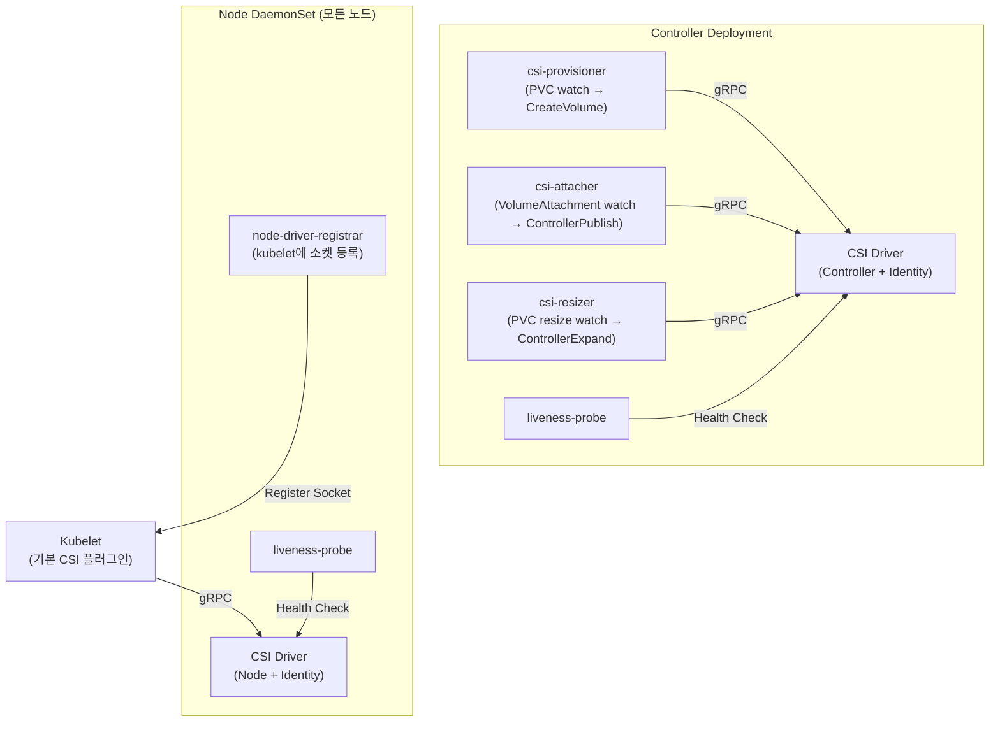
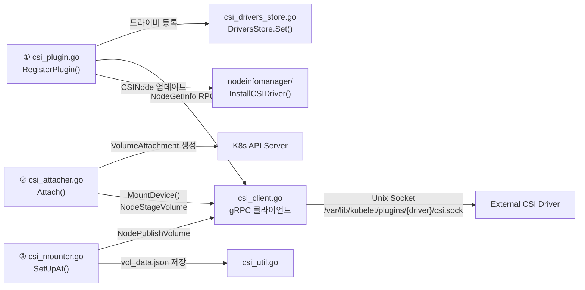
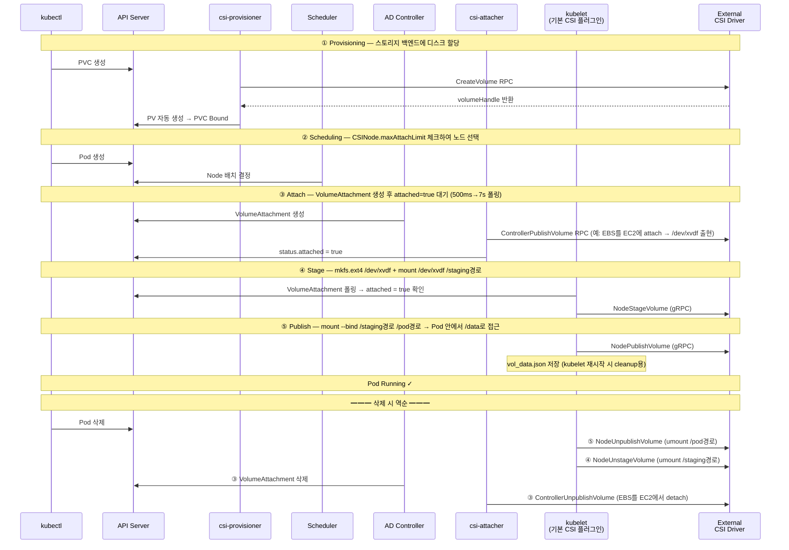
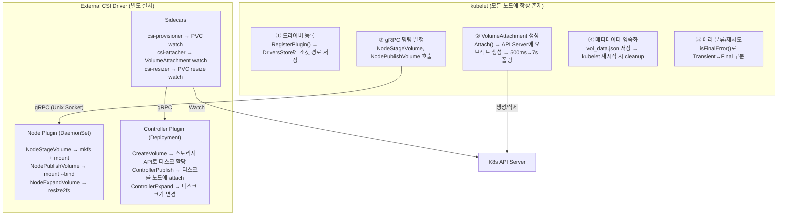

왜 Kubernetes는 기본 CSI Driver를 가지고 있고, 공통 Volume Interface가 있음에도 불구하고 External CSI Driver를 필요로 하는걸까?
한 번 알아보자 !!

<br />

## 1. CSI Driver란

CSI(Container Storage Interface)는 **컨테이너 오케스트레이션 플랫폼과 스토리지 시스템 사이의 표준 인터페이스**다.

현재의 CSI Driver는 스토리지 벤더가 **Kubernetes 코어 코드를 건드리지 않고도 자기 스토리지를 붙일 수 있게 하는 것**이 목표이다.

CSI 스펙은 **세 가지 gRPC 서비스**로 구성된다.

> **gRPC**란 Google이 만든 원격 프로시저 호출(RPC) 프레임워크다. 프로세스 간에 함수를 호출하듯 통신할 수 있게 해준다. CSI에서는 kubelet과 External Driver가 서로 다른 프로세스(Pod)이므로, gRPC로 통신한다.

| gRPC 서비스 | 역할 | 배포 형태 |
|---|---|---|
| **Identity** | Driver 이름, 버전, 지원 기능 조회 | 모든 Pod |
| **Controller** | 볼륨 생성/삭제, 노드에 attach/detach | Deployment (1개) |
| **Node** | 실제 마운트/언마운트, 파일시스템 포맷 | DaemonSet (모든 노드) |

Kubernetes에서 "CSI Driver"라고 부르면, 이 세 가지 gRPC 서비스를 구현한 **별도 바이너리(External CSI Driver)**를 말하는 것이다.

하지만 kubelet 안에도 CSI 관련 코드가 있다. 이것이 **기본 CSI 플러그인**이다.

<br />
<br />

## 2. CSI Driver의 목적과 구성 요소

### 왜 필요한가

Pod이 볼륨을 쓰려면 누군가 이 일들을 해야 한다.

1. 스토리지 백엔드에 볼륨을 **생성** (예: AWS API로 EBS 디스크 할당)
2. 해당 볼륨을 노드에 **연결(attach)** (예: EBS를 EC2에 attach → 노드에 `/dev/xvdf` 블록 디바이스가 나타남)
3. 노드에서 디스크를 **포맷하고 마운트** (예: `mkfs.ext4 /dev/xvdf` → `mount /dev/xvdf /staging경로`)
4. Pod 경로에 **바인드 마운트** (예: `mount --bind /staging경로 /pod경로` → Pod 안에서 `/data`로 접근)

> **mount**란 Linux에서 저장 장치를 디렉토리 트리에 연결하는 것이다. USB를 꽂아도 `mount /dev/sdb1 /mnt/usb`를 해야 파일에 접근할 수 있다.
> **bind mount**는 이미 마운트된 디렉토리를 **다른 경로에서도 접근**할 수 있게 하는 것이다. 원본과 바인드 경로가 같은 데이터를 가리킨다.
> **staging 경로**란 디스크를 노드에 1번 마운트하는 중간 경로다. 같은 노드의 여러 Pod이 같은 볼륨을 쓸 때, staging은 1번만 하고 Pod마다 bind mount를 추가한다.

이 작업들을 **Kubernetes 코어와 분리해서** 처리하기 위해 CSI가 존재한다.

### 구성 요소



프로덕션 드라이버(예: aws-ebs-csi-driver)는 Controller Deployment와 Node DaemonSet을 분리 배포하지만, 데모용 hostpath 드라이버는 **하나의 Pod에 모든 컨테이너를 넣는** 구조다. kind 클러스터에서 직접 확인해보면

```bash
$ kubectl get pod csi-hostpathplugin-0
NAME                   READY   STATUS    RESTARTS   AGE
csi-hostpathplugin-0   8/8     Running   0          88m     ← 8개 컨테이너가 하나의 Pod

$ kubectl get pod csi-hostpathplugin-0 -o jsonpath='{range .spec.containers[*]}{.name}{"\n"}{end}'
hostpath                                 ← CSI Driver 바이너리 (Identity + Controller + Node gRPC 서비스 구현)
csi-provisioner                          ← PVC(볼륨 요청) watch → CreateVolume / DeleteVolume
csi-attacher                             ← VolumeAttachment(볼륨-노드 연결 의도) watch → ControllerPublishVolume
csi-resizer                              ← PVC 용량 변경 watch → ControllerExpandVolume
csi-snapshotter                          ← VolumeSnapshot watch → CreateSnapshot
node-driver-registrar                    ← kubelet에 Unix 소켓 경로 등록 (소켓 = 같은 노드 내 프로세스 간 통신 채널)
csi-external-health-monitor-controller   ← 볼륨 상태 모니터링
liveness-probe                           ← 드라이버 헬스 체크
```

왜 이렇게 sidecar가 많을까? 각 sidecar는 **정확히 하나의 K8s 리소스만 watch**하고, **정확히 하나의 CSI RPC만 호출**한다. 이렇게 분리하면 sidecar별로 별도 RBAC 권한을 부여할 수 있고, 필요 없는 기능(예: 스냅샷)은 해당 sidecar를 빼면 된다.

```bash
# 각 sidecar가 어떤 권한을 갖는지 확인
$ kubectl get clusterrole | grep csi
csi-hostpathplugin-attacher       2025-04-04T00:49:07Z
csi-hostpathplugin-health-monitor-controller   2025-04-04T00:49:07Z
csi-hostpathplugin-provisioner    2025-04-04T00:49:07Z
csi-hostpathplugin-resizer        2025-04-04T00:49:07Z
csi-hostpathplugin-snapshotter    2025-04-04T00:49:07Z

# 예: provisioner는 PVC/PV 권한만 있고, attacher는 VolumeAttachment 권한만 있다
$ kubectl describe clusterrole csi-hostpathplugin-provisioner | grep -A2 Resources
  Resources          Verbs
  persistentvolumes  [get list watch create delete]
  persistentvolumeclaims [get list watch update]
```

### 연관 Kubernetes 오브젝트

| 오브젝트 | 누가 만드는가 | 역할 |
|---|---|---|
| **CSIDriver** | 드라이버 배포 시 | 드라이버 메타데이터 (attachRequired, podInfoOnMount 등) |
| **CSINode** | 기본 CSI 플러그인 | 노드별 드라이버 정보 (nodeID, topology, maxAttachLimit) |
| **VolumeAttachment** | 기본 CSI 플러그인 | 특정 PV를 특정 노드에 연결하겠다는 의도 |
| **StorageClass** | 관리자 | 어떤 CSI Driver로 프로비저닝할지 지정 |
| **PV / PVC** | csi-provisioner / 사용자 | 볼륨 정의와 요청 |

<br />
<br />

## 3. Kubernetes 내장 CSI 코드 분석 — pkg/volume/csi/

kubelet 바이너리에는 `pkg/volume/csi/` 디렉토리에 **내장 CSI 플러그인**이 포함되어 있다. 별도 설치가 필요 없다. kubelet이 시작되면 자동으로 로드된다.

### 디렉토리 구조

```
pkg/volume/csi/
├── csi_plugin.go          ← 진입점. ValidatePlugin() → RegisterPlugin()
├── csi_mounter.go         ← SetUpAt()에서 NodePublishVolume gRPC 호출
├── csi_attacher.go        ← Attach()에서 VolumeAttachment 생성, MountDevice()에서 NodeStageVolume 호출
├── csi_client.go          ← gRPC 클라이언트. Unix 소켓으로 External Driver와 통신
├── csi_block.go           ← 블록 볼륨 전용 로직
├── csi_drivers_store.go   ← 등록된 드라이버 저장소 (thread-safe map)
├── csi_util.go            ← vol_data.json 저장/로드
├── csi_metrics.go         ← gRPC 메트릭
├── csi_node_updater.go    ← CSIDriver informer 감시
├── expander.go            ← 볼륨 확장 (NodeExpandVolume)
└── nodeinfomanager/       ← CSINode 오브젝트 업데이트
```

### 코드 흐름 — 진입점에서 gRPC 호출까지



> **Unix 소켓 (`csi.sock`)**이란 같은 노드 안에서 프로세스 간 통신하는 파일이다. 네트워크를 거치지 않고 파일 경로로 연결한다. kubelet과 External Driver Pod은 같은 노드에 있으므로 `/var/lib/kubelet/plugins/{driver}/csi.sock` 파일을 통해 gRPC 통신한다.

**핵심 흐름을 한 줄로 요약하면:**

> `csi_plugin.go`에서 드라이버를 등록하고 → `csi_attacher.go`에서 VolumeAttachment를 만들어 attach를 기다린 뒤 → `csi_mounter.go`에서 실제 마운트 gRPC를 보낸다. 모든 gRPC 통신은 `csi_client.go`를 통해 Unix 소켓으로 나간다.

### 기본 CSI 플러그인이 하는 일 요약

| 역할 | 코드 위치 | 설명 |
|---|---|---|
| 드라이버 등록/해제 | csi_plugin.go | `RegisterPlugin()` → 드라이버 저장소에 추가, CSINode 업데이트 |
| VolumeAttachment 관리 | csi_attacher.go | `Attach()` → 생성 후, 점점 간격을 늘려가며(500ms→1s→2s→...→7s) `attached=true` 대기 |
| NodeStageVolume 호출 | csi_attacher.go | `MountDevice()` → `mkfs` + `mount /dev/xvdf /staging경로` |
| NodePublishVolume 호출 | csi_mounter.go | `SetUpAt()` → `mount --bind /staging경로 /pod경로` |
| gRPC 통신 | csi_client.go | Unix 소켓으로 External Driver에 RPC 전송 |
| 메타데이터 영속화 | csi_util.go | `vol_data.json` 저장 → kubelet 재시작 시 cleanup용 |
| 에러 분류/재시도 | csi_client.go | `isFinalError()`로 Transient/Final 구분 |

### External CSI Driver가 없으면 코드 어디에서 막히는가

위 다이어그램 기준으로, **①이 한 번도 일어나지 않으면 ②③ 모두 실패**한다.

```
① RegisterPlugin — External Driver 등록
   → Driver가 없으면 이 단계 자체가 발생하지 않음
   → csiDrivers 저장소(csi_drivers_store.go)가 비어있음

② Attach — VolumeAttachment 생성 + NodeStageVolume
   → VolumeAttachment은 생성되지만 csi-attacher가 없어 attached=false 유지
   → MountDevice()도 같은 이유로 실패

③ SetUpAt — NodePublishVolume  ← ★ 여기서 막힘
   → csiClientGetter.Get() 호출
   → csiDrivers.Get()에서 "driver not found"
   → Transient 에러 → kubelet 무한 재시도
```

③의 코드를 따라가보면:

```go
// ③ csi_mounter.go:103 — SetUpAt()
func (c *csiMountMgr) SetUpAt(dir string, ...) error {
    csi, err := c.csiClientGetter.Get()  // ← 여기서 막힘
    if err != nil {
        return volumetypes.NewTransientOperationFailure(...)  // 재시도 대상 에러 반환
    }
    // 이 아래는 도달하지 못한다
}
```

`Get()`은 내부에서 `newCsiDriverClient()`를 호출하는데, ①에서 등록된 드라이버가 없으므로 실패한다.

```go
// csi_client.go:153 — newCsiDriverClient()
func newCsiDriverClient(driverName csiDriverName) (*csiDriverClient, error) {
    existingDriver, driverExists := csiDrivers.Get(string(driverName))
    if !driverExists {
        // ①이 실행되지 않아 DriversStore.Set()이 호출된 적 없음 → 여기서 실패
        return nil, fmt.Errorf("driver name %s not found in the list of registered CSI drivers", driverName)
    }
    // 등록된 드라이버의 소켓 경로로 gRPC 클라이언트 생성
    return &csiDriverClient{
        addr: csiAddr(existingDriver.endpoint),  // 예: /var/lib/kubelet/plugins/xxx/csi.sock
        ...
    }, nil
}
```

결과: `Get()` 실패 → `SetUpAt()`이 Transient 에러 반환 → kubelet이 계속 재시도 → **Pod은 `ContainerCreating`에 영원히 멈춘다.**

<br />
<br />

## 4. kind 클러스터에서 기본 CSI 플러그인 확인하기

### kubelet 프로세스 확인

```bash
# kubelet은 실행 중 — 기본 CSI 플러그인이 이 안에 포함되어 있다
$ docker exec -it for-cri-control-plane ps aux | grep kubelet
root  690  /usr/bin/kubelet --bootstrap-kubeconfig=... --config=/var/lib/kubelet/config.yaml ...
```

### External Driver 부재 확인

```bash
# 소켓 디렉토리 — 비어 있다
$ docker exec -it for-cri-control-plane ls /var/lib/kubelet/plugins/
(빈 결과)

# gRPC 소켓 — 없다
$ docker exec -it for-cri-control-plane find /var/lib/kubelet/plugins/ -name "csi.sock"
(빈 결과)

# CSIDriver 오브젝트 — 없다
$ kubectl get csidrivers
No resources found
```

### CSINode — 기본 플러그인이 자동 생성한 흔적

```bash
$ kubectl get csinodes -o yaml
```

```yaml
apiVersion: storage.k8s.io/v1
kind: CSINode
metadata:
  annotations:
    # 기본 CSI 플러그인이 자동으로 기록한 CSI Migration 대상 목록
    storage.alpha.kubernetes.io/migrated-plugins: >-
      kubernetes.io/aws-ebs,
      kubernetes.io/azure-disk,
      kubernetes.io/azure-file,
      kubernetes.io/cinder,
      kubernetes.io/gce-pd,
      kubernetes.io/portworx-volume,
      kubernetes.io/vsphere-volume
  name: for-cri-control-plane
spec:
  drivers: null    # ← External Driver가 없으므로 비어 있음
```

### 현재 상태 정리

| 항목 | 상태 | 의미 |
|---|:---:|---|
| kubelet (기본 CSI 플러그인) | **동작 중** | CSINode 생성, CSIDriver 변경 감시(informer) 중 |
| Migration 어노테이션 | **기록됨** | in-tree 코드가 있어도 무시하고 **CSI Driver로 우회**한다. |
| CSIDriver 오브젝트 | **없음** | External Driver 미설치 |
| `csi.sock` 소켓 파일 | **없음** | gRPC 통신 상대 부재 |
| `spec.drivers` | **null** | 사용 가능한 드라이버 0개 |

<br />
<br />

## 5. External CSI Driver란

External CSI Driver는 **Kubernetes 코어와 별도로 배포되는** CSI 구현체다. Pod 형태로 클러스터에 설치한다.

크게 세 가지 역할로 나뉜다.

### Node Plugin (DaemonSet)

kubelet의 gRPC 호출을 받아 **실제 Linux 마운트 작업**을 수행한다.

| RPC | 실제로 실행되는 일 |
|---|---|
| `NodeStageVolume` | `mkfs.ext4 /dev/xvdf` (최초 포맷) → `mount /dev/xvdf /staging경로` |
| `NodePublishVolume` | `mount --bind /staging경로 /pod경로` (Pod 안에서 `/data`로 보임) |
| `NodeUnpublishVolume` | `umount /pod경로` |
| `NodeUnstageVolume` | `umount /staging경로` |
| `NodeExpandVolume` | `resize2fs /dev/xvdf` 또는 `xfs_growfs /staging경로` |

> **Stage와 Publish를 나누는 이유**: 같은 노드에서 여러 Pod이 같은 볼륨을 쓸 때, Stage(디스크 → 노드)는 1번만, Publish(노드 → Pod)는 Pod마다 실행된다.

### Controller Plugin (Deployment)

스토리지 벤더의 API를 호출하여 볼륨의 생명주기를 관리한다.

| RPC | AWS EBS 예시 |
|---|---|
| `CreateVolume` | EC2 API로 EBS 볼륨 생성 |
| `DeleteVolume` | EBS 볼륨 삭제 |
| `ControllerPublishVolume` | EBS를 특정 EC2 인스턴스에 attach |
| `ControllerUnpublishVolume` | EBS를 인스턴스에서 detach |
| `ControllerExpandVolume` | EBS 볼륨 크기 변경 |

### Sidecar 컨테이너

Kubernetes API를 watch하며, 변경이 감지되면 Controller Plugin에 gRPC를 전달한다.

| Sidecar | Watch 대상 | 호출 RPC |
|---|---|---|
| **csi-provisioner** | PVC 생성/삭제 | CreateVolume / DeleteVolume |
| **csi-attacher** | VolumeAttachment | ControllerPublishVolume / Unpublish |
| **csi-resizer** | PVC 용량 변경 | ControllerExpandVolume |
| **csi-snapshotter** | VolumeSnapshot | CreateSnapshot / DeleteSnapshot |
| **node-driver-registrar** | - | kubelet에 드라이버 소켓 등록 |
| **liveness-probe** | - | 드라이버 헬스 체크 |

<br />
<br />

## 6. External CSI Driver가 생긴 이유

과거에는 스토리지 드라이버가 kubelet 바이너리에 직접 포함되어 있었다. 이것이 **in-tree 방식**이다.

```
k8s.io/kubernetes/pkg/volume/
├── awsebs/          ← AWS EBS 코드가 kubelet 안에
├── gcepd/           ← GCE PD 코드가 kubelet 안에
├── azure_dd/        ← Azure Disk 코드가 kubelet 안에
├── cinder/          ← OpenStack Cinder 코드가 kubelet 안에
└── ...              ← 계속 늘어남
```

### 인지한 문제 상황

| 문제 | 설명 |
|---|---|
| **릴리스 결합** | 스토리지 버그 수정 → Kubernetes 릴리스 대기 (~4개월) |
| **바이너리 비대화** | 모든 벤더 SDK가 kubelet에 포함. 대부분 1~2개만 사용 |
| **격리 없음** | 특정 드라이버 버그 → kubelet 전체 크래시 가능 |
| **확장성 제한** | 새 스토리지 지원 → K8s 코어 PR 필수 |
| **권한 분리 불가** | 모든 스토리지 기능이 kubelet 권한으로 실행 |

### CSI로 분리한 결과

| 관점 | In-tree | External CSI |
|---|---|---|
| 배포 | K8s 바이너리에 포함 | **독립 DaemonSet/Deployment** |
| 업데이트 | K8s 업그레이드 필요 | **드라이버만 교체** |
| 격리 | 같은 프로세스 | **별도 컨테이너** |
| 권한 | kubelet 권한 전체 | **sidecar별 최소 RBAC** |
| 개발 | K8s PR 필요 | **누구나 자유롭게** |
| 기능 선택 | 전부 강제 포함 | **필요한 sidecar만 배포** |

### 관련 서비스 - CSI Migration

`pkg/volume/csimigration/` 패키지를 통해 **in-tree PV 스펙을 자동으로 CSI 호출로 변환**할 수 있다.

[KEP-625: CSI Migration Design Document](https://github.com/kubernetes/enhancements/blob/master/keps/sig-storage/625-csi-migration/README.md)

<br />
<br />

## 7. External CSI Driver 알고리즘 분석

### PVC → Pod 마운트 전체 시퀀스



### 같은 흐름을 K8s 오브젝트 관점에서 보면

위 시퀀스와 동일한 흐름을, **어떤 K8s 리소스가 언제 생기는지** 중심으로 다시 그린 것이다.


> 리소스 생성(①~④)이 먼저이고, 실제 마운트(⑤~⑥)가 마지막이다. 리소스가 준비되어야 마운트할 수 있다.

<br />
<br />

## 8. kind 클러스터에 External CSI Driver 설치하고 분석하기

kind 클러스터(v1.32.3)에 [csi-driver-host-path](https://github.com/kubernetes-csi/csi-driver-host-path)를 설치하고 Before/After를 비교해보았다.

### Before → After 비교

**CSIDriver 오브젝트**

```bash
# Before
$ kubectl get csidrivers
No resources found

# After
$ kubectl get csidrivers
NAME                  ATTACHREQUIRED   PODINFOONMOUNT   STORAGECAPACITY   MODES                  AGE
hostpath.csi.k8s.io   true             true             false             Persistent,Ephemeral   2m
```

**CSINode — `spec.drivers`**

```bash
# Before
spec:
  drivers: null

# After
spec:
  drivers:
  - name: hostpath.csi.k8s.io
    nodeID: for-cri-control-plane
    topologyKeys:
    - topology.hostpath.csi/node
```

**소켓 파일**

```bash
# Before
$ docker exec for-cri-control-plane find /var/lib/kubelet/plugins/ -name "csi.sock"
(빈 결과)

# After
$ docker exec for-cri-control-plane find /var/lib/kubelet/plugins/ -name "csi.sock"
/var/lib/kubelet/plugins/csi-hostpath/csi.sock
```

### 드라이버 등록 과정 — kubelet 로그

```
# 1. node-driver-registrar가 Identity.GetPluginInfo RPC로 드라이버 이름 확인
GRPC call: /csi.v1.Identity/GetPluginInfo
GRPC response: {"name":"hostpath.csi.k8s.io","vendor_version":"v1.17.0"}

# 2. 기본 CSI 플러그인이 드라이버를 검증하고 등록
kubelet: Trying to validate a new CSI Driver
         with name: hostpath.csi.k8s.io
         endpoint: /var/lib/kubelet/plugins/csi-hostpath/csi.sock
         versions: 1.0.0

kubelet: Register new plugin with name: hostpath.csi.k8s.io
         at endpoint: /var/lib/kubelet/plugins/csi-hostpath/csi.sock

# 3. node-driver-registrar가 등록 성공 확인
NotifyRegistrationStatus: plugin_registered:true
```

이것이 `csi_plugin.go`의 `ValidatePlugin()` → `RegisterPlugin()` 흐름이 실제로 동작하는 모습이다.

### PVC → Pod 마운트 전체 로그 추적

StorageClass와 PVC를 생성하고, Pod를 배포하여 전체 흐름을 추적한 결과는 다음과 같다.

```
시간순:

00:52:28  csi-provisioner: "ProvisioningSucceeded volume pvc-627c57f8..."
          → 1. CreateVolume RPC → PV 자동 생성 → PVC Bound

00:52:37  csi-attacher: "Started VolumeAttachment processing"
          csi-attacher: "Marked as attached"
          → 2. VolumeAttachment.status.attached = true

00:52:44  kubelet: "MountVolume.MountDevice succeeded for volume pvc-627c57f8..."
          → 3. 기본 CSI 플러그인이 NodeStageVolume + NodePublishVolume gRPC 호출
```

**vol_data.json — 기본 CSI 플러그인이 저장한 메타데이터:**

```bash
$ docker exec for-cri-control-plane find /var/lib/kubelet/pods/$POD_UID -name "vol_data.json" -exec cat {} \;
```

```json
{
  "attachmentID": "csi-3f5e7fae3234c0aceba233a7a406ff381a9c337...",
  "driverName": "hostpath.csi.k8s.io",
  "nodeName": "for-cri-control-plane",
  "specVolID": "pvc-c8794feb-921b-4266-bdb1-09668394a15f",
  "volumeHandle": "f9579330-2fc0-11f1-be2d-da9742cae13c",
  "volumeLifecycleMode": "Persistent"
}
```

**실제 마운트 확인:**

```bash
$ docker exec for-cri-control-plane mount | grep csi
/dev/vda1 on .../kubernetes.io~csi/pvc-627c57f8-.../mount type ext4 (rw,relatime)

$ kubectl exec csi-test-pod -- cat /data/test.txt
CSI works!
```

### Pod 삭제 시 역순 정리

```
00:53:48  kubelet: UnmountVolume.TearDown succeeded for volume
          → NodeUnpublishVolume → NodeUnstageVolume

00:53:48  kubelet: UnmountDevice succeeded for volume "pvc-627c57f8..."
          → VolumeAttachment 삭제 → attached=false

(PVC 삭제 시)
          csi-provisioner: GRPC call /csi.v1.Controller/DeleteVolume
          csi-provisioner: "Volume deleted" PV="pvc-627c57f8..."
```

<br />
<br />

## 9. 기본 CSI 플러그인 vs External CSI Driver의 최종 역할 비교



| 비교 항목 | 기본 CSI 플러그인 | External CSI Driver |
|---|---|---|
| **위치** | kubelet 바이너리 안 | 별도 Pod |
| **설치** | 자동 (kubelet에 포함) | 수동 (Helm, YAML 등) |
| **역할** | gRPC 클라이언트 (명령 전달) | gRPC 서버 (실제 실행) |
| **담당 RPC** | Node RPC 호출만 | Identity + Controller + Node 구현 |
| **실제 동작** | VolumeAttachment 생성, gRPC 호출 발행 | `mkfs`, `mount`, `umount`, 스토리지 API 호출 |
| **없으면?** | K8s가 볼륨 상태를 모름 | Pod이 `ContainerCreating`에 영원히 멈춤 |

<br />
<br />

## 10. External Driver를 커스텀으로 만든다면?

CSI Driver의 본질은 **gRPC 서버**다. CSI 스펙에 정의된 RPC 메서드를 구현하면, 나머지(VolumeAttachment 관리, 재시도, 메타데이터 영속화 등)는 kubelet의 기본 CSI 플러그인과 sidecar들이 알아서 처리해준다.

### 구현해야 할 것

**필수 구성 요소**

| 서비스 | RPC | 하는 일 |
|---|---|---|
| Identity | `GetPluginInfo` | 드라이버 이름, 버전 반환 |
| Identity | `GetPluginCapabilities` | "나는 Controller도 지원해" 등 기능 광고 |
| Identity | `Probe` | 헬스 체크 응답 |
| Node | `NodePublishVolume` | `mount --bind`로 Pod 경로에 볼륨 연결 |
| Node | `NodeUnpublishVolume` | `umount`로 Pod 경로에서 해제 |
| Node | `NodeGetCapabilities` | 지원 기능 광고 (Stage 지원 여부 등) |
| Node | `NodeGetInfo` | 노드 ID, 토폴로지 반환 |

**선택 — 필요한 기능에 따라 추가**

| 기능 | 추가할 RPC | 필요한 Sidecar |
|---|---|---|
| 동적 프로비저닝 (PVC → 자동 PV 생성) | `CreateVolume`, `DeleteVolume` | csi-provisioner |
| 노드에 디스크 연결 | `ControllerPublishVolume`, `ControllerUnpublishVolume` | csi-attacher |
| 2단계 마운트 (Stage → Publish) | `NodeStageVolume`, `NodeUnstageVolume` | - (kubelet이 호출) |
| 볼륨 확장 | `ControllerExpandVolume`, `NodeExpandVolume` | csi-resizer |
| 스냅샷 | `CreateSnapshot`, `DeleteSnapshot` | csi-snapshotter |

### 구현하지 않아도 되는 것

kubelet의 기본 CSI 플러그인(`pkg/volume/csi/`)과 sidecar가 알아서 해주는 것들이다.

- VolumeAttachment 생성/폴링/삭제 → `csi_attacher.go`
- PVC watch → `csi-provisioner` sidecar
- gRPC 에러 분류 및 재시도 → `csi_client.go`의 `isFinalError()`
- `vol_data.json` 영속화 → `csi_util.go`
- CSINode 오브젝트 업데이트 → `nodeinfomanager/`
- FSGroup 권한 처리, SELinux 라벨 → `csi_mounter.go`

### 공식 개발 가이드

| 문서 | 내용 |
|---|---|
| [Kubernetes CSI Developer Documentation](https://kubernetes-csi.github.io/docs/) | 개발/배포/테스트 전체 가이드 |
| [Developing a CSI Driver](https://kubernetes-csi.github.io/docs/developing.html) | 최소 구현 범위, 필수/선택 메서드 정리 |
| [Deploying a CSI Driver](https://kubernetes-csi.github.io/docs/deploying.html) | Controller Deployment + Node DaemonSet 배포 구성법 |
| [CSI Spec (GitHub)](https://github.com/container-storage-interface/spec/blob/master/spec.md) | gRPC proto 정의, 에러 코드, 시맨틱 명세 |

### 참고할 레퍼런스 구현체

| 드라이버 | 특징 |
|---|---|
| [csi-driver-host-path](https://github.com/kubernetes-csi/csi-driver-host-path) | 학습용. 가장 단순한 구현. 이 글의 kind 실습에서 사용 |
| [csi-driver-nfs](https://github.com/kubernetes-csi/csi-driver-nfs) | NFS 기반. attach 불필요한 케이스 참고 |
| [aws-ebs-csi-driver](https://github.com/kubernetes-sigs/aws-ebs-csi-driver) | 프로덕션급. 블록 스토리지 + attach + topology 전부 구현 |
