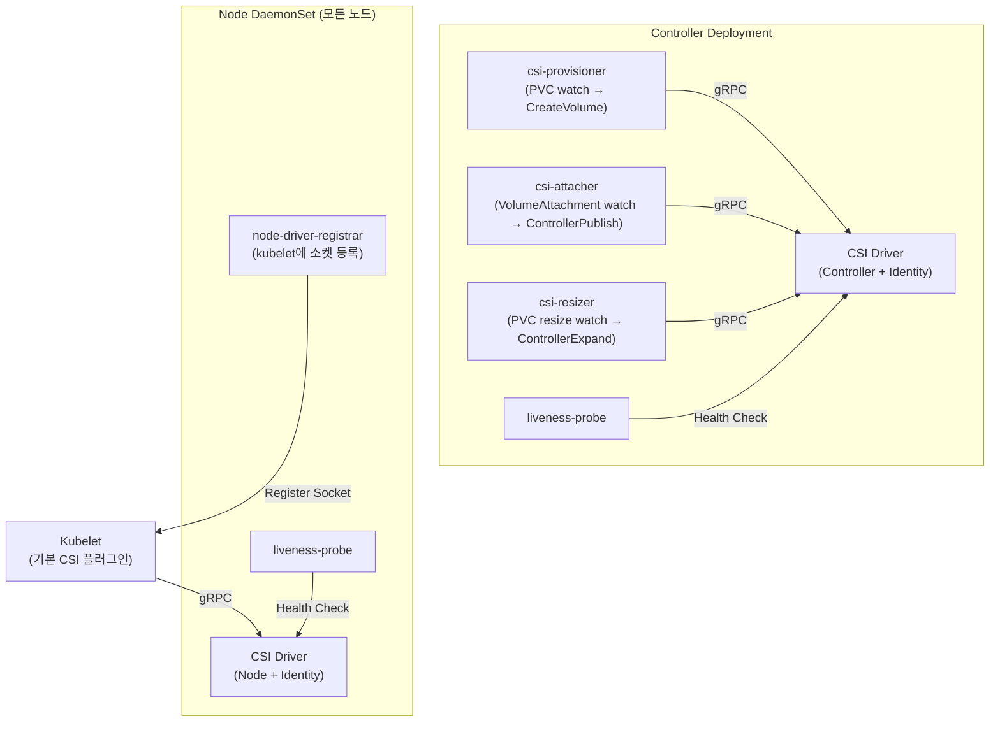
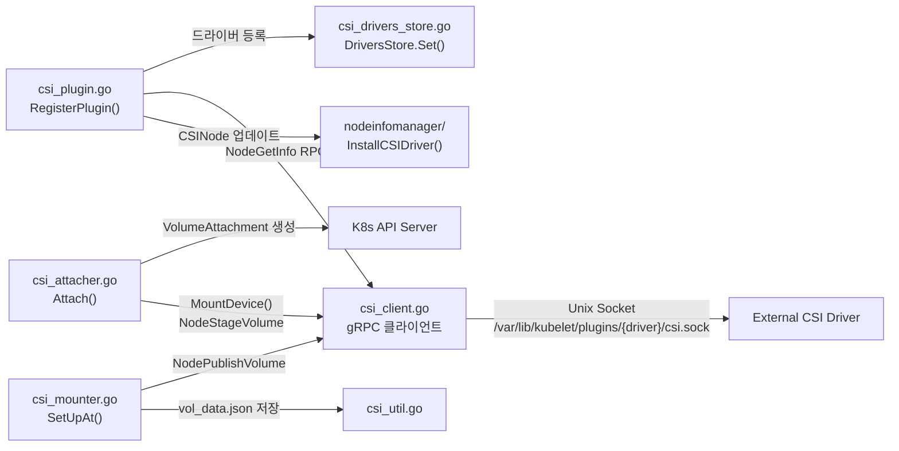
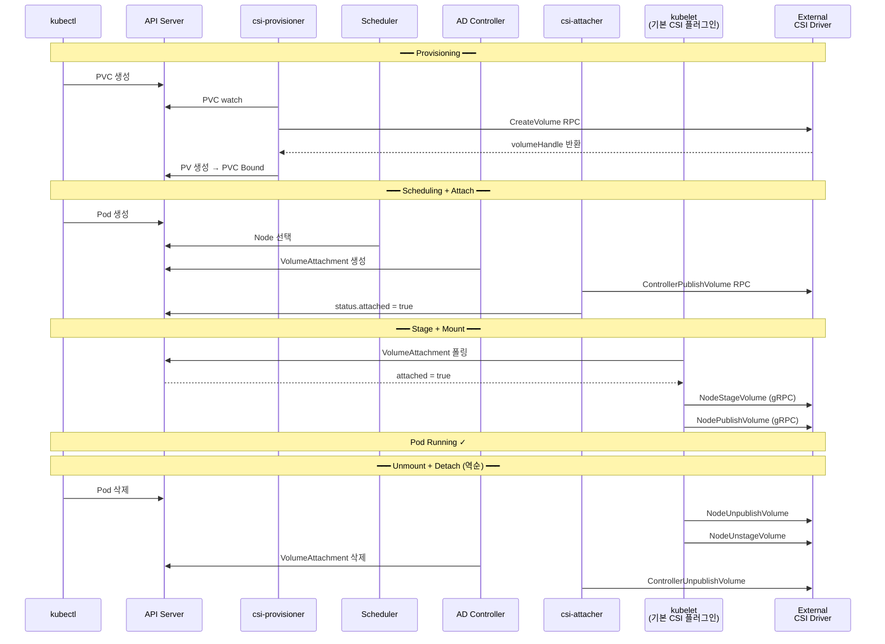
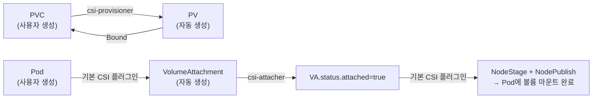
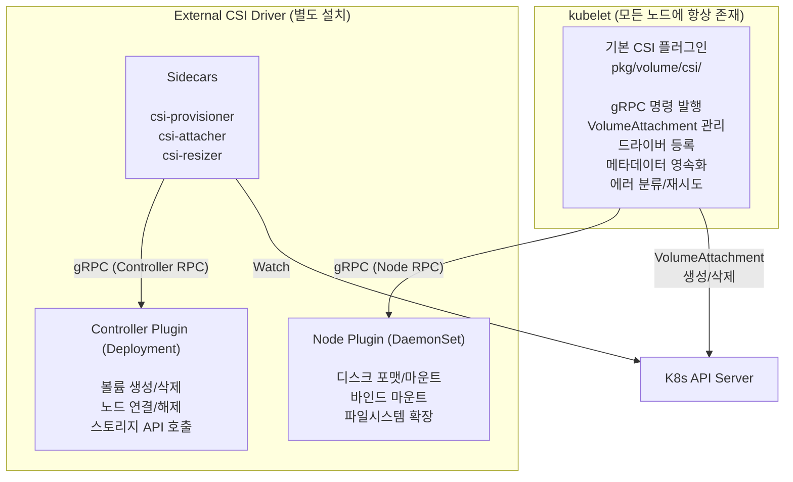

왜 Kubernetes는 기본 CSI Driver를 가지고 있고, 공통 Volume Interface가 있음에도 불구하고 External CSI Driver를 필요로 하는걸까?
한 번 알아보자 !!

<br />

## 1. CSI Driver란

CSI(Container Storage Interface)는 **컨테이너 오케스트레이션 플랫폼과 스토리지 시스템 사이의 표준 인터페이스**다.

현재의 CSI Driver는 스토리지 벤더가 **Kubernetes 코어 코드를 건드리지 않고도 자기 스토리지를 붙일 수 있게 하는 것**이 목표이다.

CSI 스펙은 **세 가지 gRPC 서비스**로 구성된다.

| gRPC 서비스 | 역할 | 배포 형태 |
|---|---|---|
| **Identity** | Driver 이름, 버전, 지원 기능 조회 | 모든 Pod |
| **Controller** | 볼륨 생성/삭제, 노드에 attach/detach | Deployment (1개) |
| **Node** | 실제 마운트/언마운트, 파일시스템 포맷 | DaemonSet (모든 노드) |

Kubernetes에서 "CSI Driver"라고 부르면, 이 세 가지 gRPC 서비스를 구현한 **별도 바이너리(External CSI Driver)**를 말하는 것이다.

하지만 kubelet 안에도 CSI 관련 코드가 있다. 이것이 **기본 CSI 플러그인**이다.

<br />
<br />

## 2. CSI Driver의 목적과 구성 요소

### 왜 필요한가

Pod이 볼륨을 쓰려면 누군가 이 일들을 해야 한다.

1. 스토리지 백엔드에 볼륨을 **생성**
2. 해당 볼륨을 노드에 **연결(attach)**
3. 노드에서 디스크를 **포맷하고 마운트**
4. Pod 경로에 **바인드 마운트**

이 작업들을 **Kubernetes 코어와 분리해서** 처리하기 위해 CSI가 존재한다.

### 구성 요소



| 컴포넌트 | 배포 | 하는 일 |
|---|---|---|
| **CSI Driver 바이너리** | Deployment + DaemonSet | Identity/Controller/Node gRPC 서비스 구현 |
| **csi-provisioner** | Deployment | PVC watch → `CreateVolume` / `DeleteVolume` |
| **csi-attacher** | Deployment | VolumeAttachment watch → `ControllerPublishVolume` |
| **csi-resizer** | Deployment | PVC 용량 변경 watch → `ControllerExpandVolume` |
| **csi-snapshotter** | Deployment | VolumeSnapshot watch → `CreateSnapshot` |
| **node-driver-registrar** | DaemonSet | kubelet에 드라이버 Unix 소켓 경로 등록 |
| **liveness-probe** | 둘 다 | 드라이버 헬스 체크 |

### 연관 Kubernetes 오브젝트

| 오브젝트 | 누가 만드는가 | 역할 |
|---|---|---|
| **CSIDriver** | 드라이버 배포 시 | 드라이버 메타데이터 (attachRequired, podInfoOnMount 등) |
| **CSINode** | 기본 CSI 플러그인 | 노드별 드라이버 정보 (nodeID, topology, maxAttachLimit) |
| **VolumeAttachment** | 기본 CSI 플러그인 | 특정 PV를 특정 노드에 연결하겠다는 의도 |
| **StorageClass** | 관리자 | 어떤 CSI Driver로 프로비저닝할지 지정 |
| **PV / PVC** | csi-provisioner / 사용자 | 볼륨 정의와 요청 |

<br />
<br />

## 3. Kubernetes 내장 CSI 코드 분석 — pkg/volume/csi/

kubelet 바이너리에는 `pkg/volume/csi/` 디렉토리에 **내장 CSI 플러그인**이 포함되어 있다. 별도 설치가 필요 없다. kubelet이 시작되면 자동으로 로드된다.

### 디렉토리 구조

```
pkg/volume/csi/
├── csi_plugin.go          ← 진입점. ValidatePlugin() → RegisterPlugin()
├── csi_mounter.go         ← SetUpAt()에서 NodePublishVolume gRPC 호출
├── csi_attacher.go        ← Attach()에서 VolumeAttachment 생성, MountDevice()에서 NodeStageVolume 호출
├── csi_client.go          ← gRPC 클라이언트. Unix 소켓으로 External Driver와 통신
├── csi_block.go           ← 블록 볼륨 전용 로직
├── csi_drivers_store.go   ← 등록된 드라이버 저장소 (thread-safe map)
├── csi_util.go            ← vol_data.json 저장/로드
├── csi_metrics.go         ← gRPC 메트릭
├── csi_node_updater.go    ← CSIDriver informer 감시
├── expander.go            ← 볼륨 확장 (NodeExpandVolume)
└── nodeinfomanager/       ← CSINode 오브젝트 업데이트
```

### 코드 흐름 — 진입점에서 gRPC 호출까지



**핵심 흐름을 한 줄로 요약하면:**

> `csi_plugin.go`에서 드라이버를 등록하고 → `csi_attacher.go`에서 VolumeAttachment를 만들어 attach를 기다린 뒤 → `csi_mounter.go`에서 실제 마운트 gRPC를 보낸다. 모든 gRPC 통신은 `csi_client.go`를 통해 Unix 소켓으로 나간다.

### 기본 CSI 플러그인이 하는 일 요약

| 역할 | 코드 위치 | 설명 |
|---|---|---|
| 드라이버 등록/해제 | csi_plugin.go | `RegisterPlugin()` → 드라이버 저장소에 추가, CSINode 업데이트 |
| VolumeAttachment 관리 | csi_attacher.go | `Attach()` → 생성, exponential backoff로 `attached=true` 대기 |
| NodeStageVolume 호출 | csi_attacher.go | `MountDevice()` → staging 경로에 마운트 |
| NodePublishVolume 호출 | csi_mounter.go | `SetUpAt()` → Pod 경로에 바인드 마운트 |
| gRPC 통신 | csi_client.go | Unix 소켓으로 External Driver에 RPC 전송 |
| 메타데이터 영속화 | csi_util.go | `vol_data.json` 저장 → kubelet 재시작 시 cleanup용 |
| 에러 분류/재시도 | csi_client.go | `isFinalError()`로 Transient/Final 구분 |

### External CSI Driver가 필요한 이유

기본 CSI 플러그인은 **gRPC 클라이언트**일 뿐이다. gRPC 호출을 받아줄 **서버(External CSI Driver)**가 없으면 아무것도 할 수 없다.

- `CreateVolume` → csi-provisioner sidecar가 해야하지만 없다.
- `ControllerPublishVolume`? → csi-attacher sidecar가 해야 하지만 없다.
- `NodePublishVolume`? → External Driver Node Plugin이 받아야 하지만 없다.

> 즉, 기본 CSI 플러그인은 "언제, 무엇을 할지" 결정하는 **지휘자**이다.

<br />
<br />

## 4. kind 클러스터에서 기본 CSI 플러그인 확인하기

### kubelet 프로세스 확인

```bash
# kubelet은 실행 중 — 기본 CSI 플러그인이 이 안에 포함되어 있다
$ docker exec -it for-cri-control-plane ps aux | grep kubelet
root  690  /usr/bin/kubelet --bootstrap-kubeconfig=... --config=/var/lib/kubelet/config.yaml ...
```

### External Driver 부재 확인

```bash
# 소켓 디렉토리 — 비어 있다
$ docker exec -it for-cri-control-plane ls /var/lib/kubelet/plugins/
(빈 결과)

# gRPC 소켓 — 없다
$ docker exec -it for-cri-control-plane find /var/lib/kubelet/plugins/ -name "csi.sock"
(빈 결과)

# CSIDriver 오브젝트 — 없다
$ kubectl get csidrivers
No resources found
```

### CSINode — 기본 플러그인이 자동 생성한 흔적

```bash
$ kubectl get csinodes -o yaml
```

```yaml
apiVersion: storage.k8s.io/v1
kind: CSINode
metadata:
  annotations:
    # 기본 CSI 플러그인이 자동으로 기록한 CSI Migration 대상 목록
    storage.alpha.kubernetes.io/migrated-plugins: >-
      kubernetes.io/aws-ebs,
      kubernetes.io/azure-disk,
      kubernetes.io/azure-file,
      kubernetes.io/cinder,
      kubernetes.io/gce-pd,
      kubernetes.io/portworx-volume,
      kubernetes.io/vsphere-volume
  name: for-cri-control-plane
spec:
  drivers: null    # ← External Driver가 없으므로 비어 있음
```

### 현재 상태 정리

| 항목 | 상태 | 의미 |
|---|:---:|---|
| kubelet (기본 CSI 플러그인) | **동작 중** | CSINode 생성, CSIDriver informer watch 중 |
| Migration 어노테이션 | **기록됨** | 7개 in-tree 드라이버를 CSI로 전환 선언 |
| CSIDriver 오브젝트 | **없음** | External Driver 미설치 |
| `csi.sock` 소켓 파일 | **없음** | gRPC 통신 상대 부재 |
| `spec.drivers` | **null** | 사용 가능한 드라이버 0개 |

> kubelet은 준비 완료 상태이지만, **연주자가 없는 상태**다.

<br />
<br />

## 5. External CSI Driver란

External CSI Driver는 **Kubernetes 코어와 별도로 배포되는** CSI 구현체다. Pod 형태로 클러스터에 설치한다.

크게 세 가지 역할로 나뉜다.

### Node Plugin (DaemonSet)

kubelet의 gRPC 호출을 받아 **실제 스토리지 작업**을 수행한다.

| RPC | 하는 일 |
|---|---|
| `NodeStageVolume` | 블록 디바이스를 노드에 마운트, 파일시스템 생성 (mkfs) |
| `NodePublishVolume` | staging 경로 → Pod 경로에 바인드 마운트 |
| `NodeUnpublishVolume` | Pod 경로 언마운트 |
| `NodeUnstageVolume` | 노드에서 디바이스 해제 |
| `NodeExpandVolume` | 파일시스템 resize (resize2fs, xfs_growfs 등) |

### Controller Plugin (Deployment)

스토리지 벤더의 API를 호출하여 볼륨의 생명주기를 관리한다.

| RPC | AWS EBS 예시 |
|---|---|
| `CreateVolume` | EC2 API로 EBS 볼륨 생성 |
| `DeleteVolume` | EBS 볼륨 삭제 |
| `ControllerPublishVolume` | EBS를 특정 EC2 인스턴스에 attach |
| `ControllerUnpublishVolume` | EBS를 인스턴스에서 detach |
| `ControllerExpandVolume` | EBS 볼륨 크기 변경 |

### Sidecar 컨테이너

Kubernetes API를 watch하며, 변경이 감지되면 Controller Plugin에 gRPC를 전달한다.

| Sidecar | Watch 대상 | 호출 RPC |
|---|---|---|
| **csi-provisioner** | PVC 생성/삭제 | CreateVolume / DeleteVolume |
| **csi-attacher** | VolumeAttachment | ControllerPublishVolume / Unpublish |
| **csi-resizer** | PVC 용량 변경 | ControllerExpandVolume |
| **csi-snapshotter** | VolumeSnapshot | CreateSnapshot / DeleteSnapshot |
| **node-driver-registrar** | - | kubelet에 드라이버 소켓 등록 |
| **liveness-probe** | - | 드라이버 헬스 체크 |

<br />
<br />

## 6. External CSI Driver가 생긴 이유

과거에는 스토리지 드라이버가 kubelet 바이너리에 직접 포함되어 있었다. 이것이 **in-tree 방식**이다.

```
k8s.io/kubernetes/pkg/volume/
├── awsebs/          ← AWS EBS 코드가 kubelet 안에
├── gcepd/           ← GCE PD 코드가 kubelet 안에
├── azure_dd/        ← Azure Disk 코드가 kubelet 안에
├── cinder/          ← OpenStack Cinder 코드가 kubelet 안에
└── ...              ← 계속 늘어남
```

### 인지한 문제 상황

| 문제 | 설명 |
|---|---|
| **릴리스 결합** | 스토리지 버그 수정 → Kubernetes 릴리스 대기 (~4개월) |
| **바이너리 비대화** | 모든 벤더 SDK가 kubelet에 포함. 대부분 1~2개만 사용 |
| **격리 없음** | 특정 드라이버 버그 → kubelet 전체 크래시 가능 |
| **확장성 제한** | 새 스토리지 지원 → K8s 코어 PR 필수 |
| **권한 분리 불가** | 모든 스토리지 기능이 kubelet 권한으로 실행 |

### CSI로 분리한 결과

| 관점 | In-tree | External CSI |
|---|---|---|
| 배포 | K8s 바이너리에 포함 | **독립 DaemonSet/Deployment** |
| 업데이트 | K8s 업그레이드 필요 | **드라이버만 교체** |
| 격리 | 같은 프로세스 | **별도 컨테이너** |
| 권한 | kubelet 권한 전체 | **sidecar별 최소 RBAC** |
| 개발 | K8s PR 필요 | **누구나 자유롭게** |
| 기능 선택 | 전부 강제 포함 | **필요한 sidecar만 배포** |

### 관련 서비스 - CSI Migration

`pkg/volume/csimigration/` 패키지를 통해 **in-tree PV 스펙을 자동으로 CSI 호출로 변환**할 수 있다.

[KEP-625: CSI Migration Design Document](https://github.com/kubernetes/enhancements/blob/master/keps/sig-storage/625-csi-migration/README.md)

<br />
<br />

## 7. External CSI Driver 알고리즘 분석

### PVC → Pod 마운트 전체 시퀀스



### 단계별 설명

| 단계 | 누가 | 코드 위치 | gRPC / 동작 |
|---|---|---|---|
| **1. Provisioning** | csi-provisioner | external-provisioner 라이브러리 | `CreateVolume` → PV 생성 |
| **2. Scheduling** | Scheduler | `pkg/scheduler/.../csi.go` | CSINode의 maxAttachLimit 체크 |
| **3. Attach** | 기본 CSI 플러그인 | `csi_attacher.go` `Attach()` | VolumeAttachment 생성 → 500ms~7s backoff로 폴링 |
| **4. ControllerPublish** | csi-attacher | external-attacher 라이브러리 | VolumeAttachment watch → `ControllerPublishVolume` |
| **5. Stage** | 기본 CSI 플러그인 | `csi_attacher.go` `MountDevice()` | `NodeStageVolume` → staging 경로에 마운트 |
| **6. Mount** | 기본 CSI 플러그인 | `csi_mounter.go` `SetUpAt()` | `NodePublishVolume` → Pod 경로에 바인드 마운트 |
| **7. 메타데이터 저장** | 기본 CSI 플러그인 | `csi_util.go` `saveVolumeData()` | `vol_data.json` 파일 생성 |

### 에러가 나면?

기본 CSI 플러그인의 `csi_client.go`에 있는 `isFinalError()` 함수가 gRPC 에러를 분류한다.

| 에러 유형 | 재시도 | 예시 |
|---|---|---|
| **Transient** (일시적) | O | Deadline exceeded, Unavailable, Resource exhausted |
| **Final** (영구적) | X | Invalid argument, Permission denied, Not found |

Transient 에러는 kubelet의 volume manager가 자동으로 재시도한다. Attach는 500ms~7s exponential backoff, Mount는 100ms~5s backoff다.

### 생성되는 리소스 흐름



<br />
<br />

## 8. kind 클러스터에 External CSI Driver 설치하고 분석하기

kind 클러스터(v1.32.3)에 [csi-driver-host-path](https://github.com/kubernetes-csi/csi-driver-host-path)를 설치하고 Before/After를 비교해보았다.

### Before → After 비교

**CSIDriver 오브젝트**

```bash
# Before
$ kubectl get csidrivers
No resources found

# After
$ kubectl get csidrivers
NAME                  ATTACHREQUIRED   PODINFOONMOUNT   STORAGECAPACITY   MODES                  AGE
hostpath.csi.k8s.io   true             true             false             Persistent,Ephemeral   2m
```

**CSINode — `spec.drivers`**

```bash
# Before
spec:
  drivers: null

# After
spec:
  drivers:
  - name: hostpath.csi.k8s.io
    nodeID: for-cri-control-plane
    topologyKeys:
    - topology.hostpath.csi/node
```

**소켓 파일**

```bash
# Before
$ docker exec for-cri-control-plane find /var/lib/kubelet/plugins/ -name "csi.sock"
(빈 결과)

# After
$ docker exec for-cri-control-plane find /var/lib/kubelet/plugins/ -name "csi.sock"
/var/lib/kubelet/plugins/csi-hostpath/csi.sock
```

### 드라이버 등록 과정 — kubelet 로그

```
# node-driver-registrar가 Identity.GetPluginInfo RPC로 드라이버 이름 확인
GRPC call: /csi.v1.Identity/GetPluginInfo
GRPC response: {"name":"hostpath.csi.k8s.io","vendor_version":"v1.17.0"}

# 기본 CSI 플러그인이 드라이버를 검증하고 등록
kubelet: Trying to validate a new CSI Driver
         with name: hostpath.csi.k8s.io
         endpoint: /var/lib/kubelet/plugins/csi-hostpath/csi.sock
         versions: 1.0.0

kubelet: Register new plugin with name: hostpath.csi.k8s.io
         at endpoint: /var/lib/kubelet/plugins/csi-hostpath/csi.sock

# node-driver-registrar가 등록 성공 확인
NotifyRegistrationStatus: plugin_registered:true
```

이것이 `csi_plugin.go`의 `ValidatePlugin()` → `RegisterPlugin()` 흐름이 실제로 동작하는 모습이다.

### PVC → Pod 마운트 전체 로그 추적

StorageClass와 PVC를 생성하고, Pod를 배포하여 전체 흐름을 추적한 결과는 다음과 같다.

```
시간순:

00:52:28  csi-provisioner: "ProvisioningSucceeded volume pvc-627c57f8..."
          → CreateVolume RPC → PV 자동 생성 → PVC Bound

00:52:37  csi-attacher: "Started VolumeAttachment processing"
          csi-attacher: "Marked as attached"
          → VolumeAttachment.status.attached = true

00:52:44  kubelet: "MountVolume.MountDevice succeeded for volume pvc-627c57f8..."
          → 기본 CSI 플러그인이 NodeStageVolume + NodePublishVolume gRPC 호출
```

**vol_data.json — 기본 CSI 플러그인이 저장한 메타데이터:**

```bash
$ docker exec for-cri-control-plane find /var/lib/kubelet/pods/$POD_UID -name "vol_data.json" -exec cat {} \;
```

```json
{
  "attachmentID": "csi-3f5e7fae3234c0aceba233a7a406ff381a9c337...",
  "driverName": "hostpath.csi.k8s.io",
  "nodeName": "for-cri-control-plane",
  "specVolID": "pvc-c8794feb-921b-4266-bdb1-09668394a15f",
  "volumeHandle": "f9579330-2fc0-11f1-be2d-da9742cae13c",
  "volumeLifecycleMode": "Persistent"
}
```

**실제 마운트 확인:**

```bash
$ docker exec for-cri-control-plane mount | grep csi
/dev/vda1 on .../kubernetes.io~csi/pvc-627c57f8-.../mount type ext4 (rw,relatime)

$ kubectl exec csi-test-pod -- cat /data/test.txt
CSI works!
```

### Pod 삭제 시 역순 정리

```
00:53:48  kubelet: UnmountVolume.TearDown succeeded for volume
          → NodeUnpublishVolume → NodeUnstageVolume

00:53:48  kubelet: UnmountDevice succeeded for volume "pvc-627c57f8..."
          → VolumeAttachment 삭제 → attached=false

(PVC 삭제 시)
          csi-provisioner: GRPC call /csi.v1.Controller/DeleteVolume
          csi-provisioner: "Volume deleted" PV="pvc-627c57f8..."
```

<br />
<br />

## 9. 기본 CSI 플러그인 vs External CSI Driver의 최종 역할 비교



| 비교 항목 | 기본 CSI 플러그인 | External CSI Driver |
|---|---|---|
| **위치** | kubelet 바이너리 안 | 별도 Pod |
| **설치** | 자동 (kubelet에 포함) | 수동 (Helm, YAML 등) |
| **역할** | gRPC 클라이언트 (지휘자) | gRPC 서버 (연주자) |
| **담당 RPC** | Node RPC 호출만 | Identity + Controller + Node 구현 |
| **스토리지 접근** | 없음 | 실제 스토리지 백엔드 통신 |
| **없으면?** | K8s가 볼륨 상태를 모름 | Pod이 `ContainerCreating`에 영원히 멈춤 |

### 문제 발생 시 어디를 봐야 하는가

| 증상 | 원인 위치 | 확인 방법 |
|---|---|---|
| PVC가 Pending 유지 | csi-provisioner 또는 Driver | `kubectl logs deploy/csi-provisioner` |
| VolumeAttachment attached=false 유지 | csi-attacher 또는 Driver | `kubectl logs deploy/csi-attacher` |
| attached=true인데 Mount 실패 | 기본 CSI 플러그인 (kubelet) | kubelet 로그: `NodePublishVolume` |
| NodePublish 타임아웃 | CSI Driver 응답 지연 | Driver Pod 로그, 디스크 I/O |
| VolumeAttachment 생성 안 됨 | 기본 CSI 플러그인 (kubelet) | kubelet 로그: `attacher.Attach` |

<br />
<br />

## 10. External Driver를 커스텀으로 만든다면?


### 참고할 레퍼런스 구현체

| 드라이버 | 특징 |
|---|---|
| [csi-driver-host-path](https://github.com/kubernetes-csi/csi-driver-host-path) | 학습용. 가장 단순한 구현. kind에서 바로 테스트 가능 |
| [csi-driver-nfs](https://github.com/kubernetes-csi/csi-driver-nfs) | NFS 기반. attach 불필요 케이스 |
| [aws-ebs-csi-driver](https://github.com/kubernetes-sigs/aws-ebs-csi-driver) | 프로덕션급. 블록 스토리지 + attach + topology 전부 구현 |
