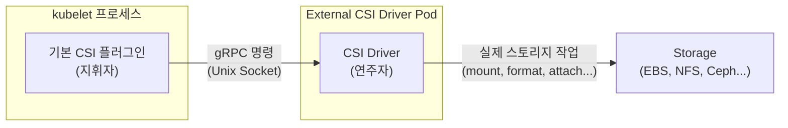
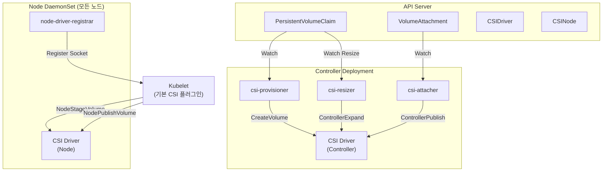
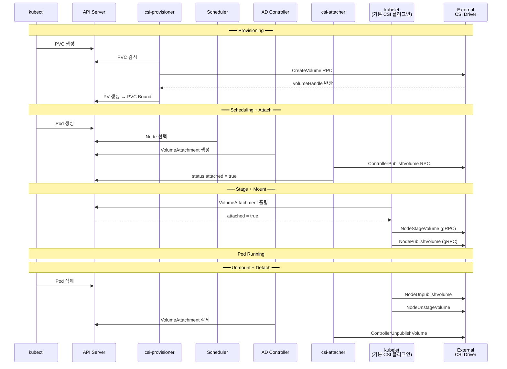
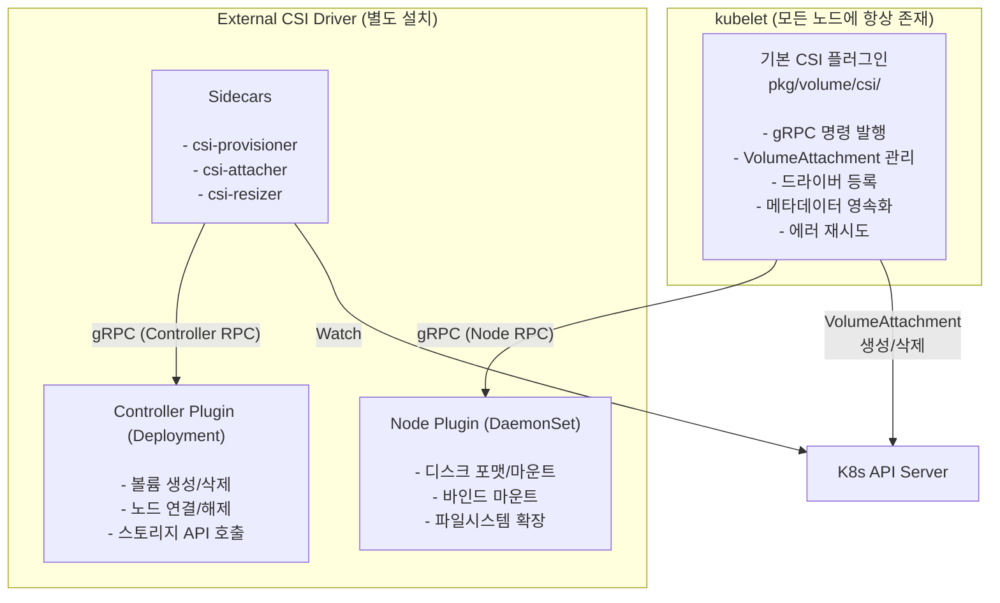

Kubernetes 소스코드 `pkg/volume/csi/`를 열어보면 CSI 관련 코드가 이미 들어있다.
그런데 왜 별도의 External CSI Driver를 설치해야 할까?

이 글은 **Kubernetes v1.33 소스코드 기반**으로 작성되었다.

<br />

## 기본 CSI 플러그인이란?

Kubernetes kubelet 바이너리에는 `pkg/volume/csi/`라는 **내장(built-in) CSI 플러그인**이 포함되어 있다.

이 플러그인은 **모든 Kubernetes 노드에 kubelet과 함께 항상 존재**한다. 별도 설치가 필요 없다. kubelet이 시작되면 자동으로 로드된다.

```
kubelet 바이너리
└── pkg/volume/csi/        ← 기본 CSI 플러그인
    ├── csi_plugin.go      (진입점)
    ├── csi_mounter.go     (마운트/언마운트)
    ├── csi_attacher.go    (어태치/디태치)
    ├── csi_client.go      (gRPC 클라이언트)
    ├── csi_block.go       (블록 볼륨)
    └── ...
```

그런데 이 코드만으로는 **볼륨을 사용할 수 없다**. 이유가 무엇인지 알아보자 !

<br />
<br />

## 기본 플러그인은 "지휘자"이고, External Driver는 "연주자"

한 문장으로 요약하면 이렇다.

| 구분 | 역할 | 비유 | 없으면? |
|---|---|---|---|
| **기본 CSI 플러그인** | "언제, 무엇을 해야 하는지" 판단하고 gRPC로 명령을 보냄 | 지휘자 | Kubernetes가 볼륨 상태를 모름 |
| **External CSI Driver** | 명령을 받아 실제 디스크를 포맷하고 마운트 | 연주자 | Pod이 `ContainerCreating`에 영원히 멈춤 |

다이어그램은 다음과 같다.



<br />
<br />

## 기본 CSI 플러그인이 하는 일 (지휘자)

`pkg/volume/csi/` 코드가 담당하는 역할을 정리하면 다음과 같다.

<br />

### 1. gRPC 명령 발행

kubelet의 volume manager가 "이 Pod에 볼륨을 마운트해라"라고 지시하면, 기본 CSI 플러그인은 Unix 소켓을 통해 External Driver에 gRPC 호출을 보낸다.

```go
// csi_client.go — Unix 소켓으로 gRPC 연결
func newGrpcConn(addr csiAddr, ...) (*grpc.ClientConn, error) {
    return grpc.Dial(
        string(addr),  // 예: /var/lib/kubelet/plugins/ebs.csi.aws.com/csi.sock
        grpc.WithTransportCredentials(insecure.NewCredentials()),
        ...
    )
}
```

보내는 gRPC 호출 목록:

| gRPC RPC | 언제 호출 | 코드 위치 |
|----------|----------|----------|
| `NodeStageVolume` | 볼륨을 노드에 준비 (staging) | csi_attacher.go |
| `NodePublishVolume` | Pod 경로에 마운트 | csi_mounter.go |
| `NodeUnpublishVolume` | Pod 경로에서 해제 | csi_mounter.go |
| `NodeUnstageVolume` | 노드에서 staging 해제 | csi_attacher.go |
| `NodeExpandVolume` | 볼륨 확장 | expander.go |
| `NodeGetVolumeStats` | 용량/사용량 조회 | csi_metrics.go |

<br />

### 2. VolumeAttachment 관리

Pod가 노드에 스케줄되면 VolumeAttachment API 객체를 생성하고, exponential backoff(초기 500ms, 최대 7s)로 `status.attached == true`가 될 때까지 폴링한다.

```go
// csi_attacher.go — VolumeAttachment 생성
func (c *csiAttacher) Attach(spec *volume.Spec, nodeName types.NodeName) (string, error) {
    attachID := getAttachmentName(pvSrc.VolumeHandle, pvSrc.Driver, node)
    attachment := &storage.VolumeAttachment{
        ObjectMeta: metav1.ObjectMeta{Name: attachID},
        Spec: storage.VolumeAttachmentSpec{
            NodeName: node,
            Attacher: pvSrc.Driver,
            Source:   vaSrc,
        },
    }
    c.k8s.StorageV1().VolumeAttachments().Create(ctx, attachment, ...)
}
```

<br />

### 3. 드라이버 등록/해제 + CSINode 업데이트

External Driver가 노드에 배포되면 `node-driver-registrar`가 kubelet에 등록 요청을 보내고, 기본 CSI 플러그인이 이를 처리한다.

- `RegisterPlugin()` — 드라이버를 내부 저장소에 추가, `NodeGetInfo` RPC 호출
- Node 어노테이션 `csi.volume.kubernetes.io/nodeid`에 드라이버별 NodeID 저장
- CSINode 오브젝트 업데이트 (maxAttachLimit, 토폴로지)

<br />

### 4. 메타데이터 영속화 + 에러 재시도

마운트 시 `vol_data.json` 파일에 메타데이터를 저장한다. kubelet이 재시작되어도 이 파일에서 정보를 읽어 cleanup할 수 있다.

```json
{
  "specVolID": "my-pvc",
  "volumeHandle": "vol-12345",
  "driverName": "ebs.csi.aws.com",
  "nodeName": "worker-1",
  "attachmentID": "csi-abc123...",
  "volumeLifecycleMode": "Persistent"
}
```

gRPC 에러 시 `isFinalError()`로 Transient/Final 에러를 분류하여 재시도 여부를 결정한다.

<br />
<br />

## External CSI Driver가 하는 일 (연주자)

External Driver는 **별도의 Pod**으로 배포되며, 세 가지 역할로 나뉜다.

<br />

### Node Plugin (DaemonSet) — 실제 마운트 수행

kubelet의 gRPC 호출을 받아 **실제 스토리지 작업**을 수행한다. 이것이 없으면 디스크를 포맷하거나 마운트할 주체가 없다.

| RPC | 실제로 하는 일 |
|-----|-------------|
| `NodeStageVolume` | 블록 디바이스를 노드에 마운트, 파일시스템 생성 (mkfs) |
| `NodePublishVolume` | staging 경로 → Pod 경로에 바인드 마운트 |
| `NodeUnpublishVolume` | Pod 경로 언마운트 |
| `NodeUnstageVolume` | 노드에서 디바이스 해제 |
| `NodeExpandVolume` | 파일시스템 resize (resize2fs, xfs_growfs 등) |
| `NodeGetVolumeStats` | df/statfs 호출 결과 반환 |

<br />

### Controller Plugin (Deployment) — 스토리지 백엔드 통신

스토리지 벤더의 API를 호출하여 볼륨의 생명주기를 관리한다.

| CSI RPC | AWS EBS 예시 |
|---------|------------|
| `CreateVolume` | EC2 API로 EBS 볼륨 생성 |
| `DeleteVolume` | EBS 볼륨 삭제 |
| `ControllerPublishVolume` | EBS를 특정 EC2 인스턴스에 attach |
| `ControllerUnpublishVolume` | EBS를 인스턴스에서 detach |
| `ControllerExpandVolume` | EBS 볼륨 크기 변경 |

<br />

### Sidecar 컨테이너 — K8s API ↔ Controller Plugin 브릿지

Kubernetes API를 watch하며, 변경이 감지되면 Controller Plugin에 gRPC를 전달한다.

| Sidecar | Watch 대상 | 호출 RPC |
|---------|-----------|---------|
| **csi-provisioner** | PVC 생성/삭제 | CreateVolume / DeleteVolume |
| **csi-attacher** | VolumeAttachment | ControllerPublishVolume / ControllerUnpublishVolume |
| **csi-resizer** | PVC 용량 변경 | ControllerExpandVolume |
| **csi-snapshotter** | VolumeSnapshot | CreateSnapshot / DeleteSnapshot |
| **node-driver-registrar** | - | kubelet에 드라이버 소켓 등록 |
| **liveness-probe** | - | 드라이버 헬스 체크 |

<br />

### 전체 컴포넌트 아키텍처



<br />
<br />

## External Driver가 없으면 어떻게 되는가?

기본 CSI 플러그인이 gRPC 호출을 보내려고 하지만, **상대방이 없다**.

```go
// csi_mounter.go — SetUpAt()
func (c *csiMountMgr) SetUpAt(dir string, mounterArgs volume.MounterArgs) error {
    csi, err := c.csiClientGetter.Get()  // ← Unix 소켓 연결 시도
    if err != nil {
        // Driver Pod이 없으면 소켓 파일 자체가 없음
        // → "no such file: /var/lib/kubelet/plugins/xxx/csi.sock"
        return err
    }
    // 여기까지 도달하지 못한다
    csi.NodePublishVolume(ctx, ...)
}
```

| 단계 | Driver 없을 때 | Driver 있을 때 |
|------|:---:|:---:|
| PVC 생성 | Pending 무한 대기 | csi-provisioner → CreateVolume → PV 생성 |
| Attach | VolumeAttachment attached=false 유지 | csi-attacher → ControllerPublishVolume |
| Stage | gRPC 연결 실패 | NodeStageVolume → 디스크 마운트 |
| Mount | gRPC 연결 실패 | NodePublishVolume → Pod 경로 바인드 마운트 |
| **결과** | **Pod: ContainerCreating 무한** | **정상 동작** |

<br />
<br />

## 그러면 왜 이렇게 분리했을까? — In-tree의 한계

과거에는 스토리지 드라이버가 kubelet 바이너리에 직접 포함되어 있었다.

```
k8s.io/kubernetes/pkg/volume/
├── awsebs/          ← AWS EBS 코드가 kubelet 안에
├── gcepd/           ← GCE PD 코드가 kubelet 안에
├── azure_dd/        ← Azure Disk 코드가 kubelet 안에
├── cinder/          ← OpenStack Cinder 코드가 kubelet 안에
└── ...              ← 계속 늘어남
```

| 문제 | 설명 |
|------|------|
| **릴리스 결합** | 스토리지 버그 수정 → Kubernetes 릴리스 대기 (~4개월) |
| **바이너리 비대화** | 모든 벤더 SDK가 kubelet에 포함. 대부분 1~2개만 사용 |
| **격리 없음** | 특정 드라이버 버그 → kubelet 전체 크래시 |
| **확장성 제한** | 새 스토리지 지원 → K8s 코어 PR 필수 |

CSI는 이 문제를 **프로세스 분리**로 해결했다.

| 관점 | In-tree | External CSI |
|------|---------|-------------|
| 배포 | K8s 바이너리에 포함 | **독립 DaemonSet/Deployment** |
| 업데이트 | K8s 업그레이드 필요 | **드라이버만 교체** |
| 격리 | 같은 프로세스 | **별도 컨테이너** |
| 권한 | kubelet 권한 전체 | **sidecar별 최소 RBAC** |
| 개발 | K8s PR 필요 | **누구나 자유롭게** |

<br />
<br />

## CSI Migration — In-tree에서 CSI로의 전환

기존 in-tree 드라이버를 사용하던 클러스터는 어떻게 될까?

Kubernetes는 `pkg/volume/csimigration/` 패키지를 통해 **기존 in-tree PV 스펙을 자동으로 CSI 호출로 변환**한다. 사용자는 매니페스트를 수정할 필요가 없다.


예를 들어, 아래와 같은 기존 PV는 수정 없이 그대로 동작한다.

```yaml
apiVersion: v1
kind: PersistentVolume
metadata:
  name: old-ebs-volume
spec:
  awsElasticBlockStore:    # ← in-tree 스펙 그대로
    volumeID: vol-12345
    fsType: ext4
```

kubelet이 이 PV를 처리할 때, csimigration 계층이 내부적으로 `ebs.csi.aws.com` CSI 드라이버 호출로 변환한다.

<br />

### Migration 진행 상황

Kubernetes 1.25에서 **CSI Migration 프레임워크 자체가 GA**가 되었고, `CSIMigration` feature gate는 비활성화할 수 없게 되었다. 각 드라이버별 마이그레이션 현황은 다음과 같다.

| In-tree Driver | GA 버전 | In-tree 제거 목표 | External CSI Driver |
|----------------|---------|------------------|-------------------|
| **AWS EBS** | 1.25 | 1.27 | `ebs.csi.aws.com` |
| **GCE PD** | 1.25 | 1.27 | `pd.csi.storage.gke.io` |
| **Azure Disk** | 1.24 | 1.26 | `disk.csi.azure.com` |
| **vSphere** | 1.25 | 1.28 | `csi.vsphere.vmware.com` |
| **OpenStack Cinder** | 1.24 | 1.26 | `cinder.csi.openstack.org` |
| **Portworx** | 1.25 (beta) | 1.29 | `pxd.portworx.com` |

> **요점**: in-tree 코드는 점진적으로 제거되고 있으며, 최종적으로 `pkg/volume/csi/` (기본 CSI 플러그인) + External Driver 조합만 남게 된다.

<br />
<br />

## PVC → Pod 마운트 전체 흐름

기본 CSI 플러그인과 External Driver가 **협력하는 전체 과정**이다.



<br />
<br />

## Kubernetes CSI 관련 오브젝트

External CSI Driver가 동작하면 다음 오브젝트들이 생성된다.

<br />

### CSIDriver — 드라이버 메타데이터

```yaml
apiVersion: storage.k8s.io/v1
kind: CSIDriver
metadata:
  name: ebs.csi.aws.com
spec:
  attachRequired: true       # Attach 단계가 필요한가?
  podInfoOnMount: false       # NodePublish 시 Pod 정보 전달?
  volumeLifecycleModes:
    - Persistent
    - Ephemeral
  storageCapacity: true
```

<br />

### CSINode — 노드별 드라이버 정보

```yaml
apiVersion: storage.k8s.io/v1
kind: CSINode
metadata:
  name: worker-node-1
spec:
  drivers:
    - name: ebs.csi.aws.com
      nodeID: "i-1234567890abcdef0"
      topologyKeys:
        - topology.ebs.csi.aws.com/zone
      allocatable:
        count: 25             # 이 노드에서 최대 25개 볼륨
```

<br />

### VolumeAttachment — 볼륨-노드 연결 상태

```yaml
apiVersion: storage.k8s.io/v1
kind: VolumeAttachment
metadata:
  name: csi-abc123...
spec:
  attacher: ebs.csi.aws.com
  nodeName: worker-node-1
  source:
    persistentVolumeName: pvc-12345
status:
  attached: true              # csi-attacher가 true로 변경
```

<br />

### StorageClass — 프로비저닝 설정

```yaml
apiVersion: storage.k8s.io/v1
kind: StorageClass
metadata:
  name: ebs-gp3
provisioner: ebs.csi.aws.com  # 어떤 CSI 드라이버를 사용할지
parameters:
  type: gp3
  encrypted: "true"
allowVolumeExpansion: true
```

<br />
<br />

## 소스코드 레벨 — 인터페이스 구조

> 코드 수준의 상세 분석이 필요 없다면 이 섹션은 건너뛰어도 된다.

모든 볼륨 플러그인 (in-tree든 CSI든)은 `pkg/volume/`에 정의된 **동일한 인터페이스**를 구현한다.

<br />

### Plugin 인터페이스 (팩토리) — "무엇을 만들 수 있는가"

```go
// pkg/volume/plugins.go
type VolumePlugin interface {
    Init(host VolumeHost) error
    GetPluginName() string
    CanSupport(spec *Spec) bool
    NewMounter(spec *Spec, podRef *v1.Pod) (Mounter, error)
    NewUnmounter(name string, podUID types.UID) (Unmounter, error)
    // ...
}

type AttachableVolumePlugin interface {
    DeviceMountableVolumePlugin
    NewAttacher() (Attacher, error)
    NewDetacher() (Detacher, error)
    CanAttach(spec *Spec) (bool, error)
}
```

<br />

### Volume 인터페이스 (실행자) — "실제로 무엇을 하는가"

```go
// pkg/volume/volume.go
type Mounter interface {
    Volume
    SetUp(mounterArgs MounterArgs) error
    SetUpAt(dir string, mounterArgs MounterArgs) error
}

type Attacher interface {
    DeviceMounter
    Attach(spec *Spec, nodeName types.NodeName) (string, error)
    WaitForAttach(spec *Spec, devicePath string, pod *v1.Pod, timeout time.Duration) (string, error)
}
```

<br />

### CSI 플러그인의 구현체

기본 CSI 플러그인은 위 인터페이스를 **4개의 구조체**로 구현한다. 소스코드에서 `var _ volume.X = &Y{}` 패턴으로 컴파일 타임에 보장한다.

```go
// 팩토리 (csi_plugin.go)
var _ volume.VolumePlugin                = &csiPlugin{}
var _ volume.AttachableVolumePlugin      = &csiPlugin{}
var _ volume.DeviceMountableVolumePlugin = &csiPlugin{}
var _ volume.BlockVolumePlugin           = &csiPlugin{}
var _ volume.NodeExpandableVolumePlugin  = &csiPlugin{}      // expander.go

// 파일시스템 마운트 (csi_mounter.go)
var _ volume.Mounter   = &csiMountMgr{}
var _ volume.Unmounter = &csiMountMgr{}

// Attach + Stage (csi_attacher.go)
var _ volume.Attacher        = &csiAttacher{}
var _ volume.Detacher        = &csiAttacher{}
var _ volume.DeviceMounter   = &csiAttacher{}
var _ volume.DeviceUnmounter = &csiAttacher{}

// 블록 디바이스 (csi_block.go)
var _ volume.CustomBlockVolumeMapper   = &csiBlockMapper{}
var _ volume.CustomBlockVolumeUnmapper = &csiBlockMapper{}
```

| 구조체 | 파일 | 역할 | 호출하는 gRPC |
|--------|------|------|-------------|
| `csiPlugin` | csi_plugin.go | 중앙 팩토리 | - |
| `csiMountMgr` | csi_mounter.go | FS 마운트/언마운트 | NodePublish/Unpublish |
| `csiAttacher` | csi_attacher.go | Attach + Stage | NodeStage/Unstage |
| `csiBlockMapper` | csi_block.go | 블록 디바이스 매핑 | NodeStage/Publish |

<br />

### 기본 플러그인이 구현하지 않는 인터페이스

| 미구현 인터페이스 | 이유 |
|-----------------|------|
| ProvisionableVolumePlugin | CreateVolume은 **csi-provisioner** sidecar가 처리 |
| DeletableVolumePlugin | DeleteVolume은 **csi-provisioner** sidecar가 처리 |
| ExpandableVolumePlugin | ControllerExpandVolume은 **csi-resizer** sidecar가 처리 |

**기본 플러그인은 Node 서비스 RPC만 담당**하고, Controller 서비스 RPC는 External sidecar Pod이 처리한다. 이것이 바로 kubelet만으로는 볼륨을 사용할 수 없는 구조적 이유다.

<br />
<br />

## 문제 발생 시 어디를 봐야 하는가

| 증상 | 원인 위치 | 확인 방법 |
|------|----------|----------|
| PVC가 Pending 유지 | csi-provisioner 또는 Driver | `kubectl logs deploy/csi-provisioner` |
| VolumeAttachment attached=false 유지 | csi-attacher 또는 Driver | `kubectl logs deploy/csi-attacher` |
| attached=true인데 Mount 실패 | 기본 CSI 플러그인 (kubelet) | kubelet 로그: `NodePublishVolume` |
| NodePublish 타임아웃 | CSI Driver 응답 지연 | Driver Pod 로그, 디스크 I/O |
| VolumeAttachment 생성 안 됨 | 기본 CSI 플러그인 (kubelet) | kubelet 로그: `attacher.Attach` |

<br />
<br />

## 정리



- **기본 CSI 플러그인** (`pkg/volume/csi/`) 은 kubelet에 항상 포함되어 있다. 설치할 필요 없다. 하지만 이것은 gRPC 클라이언트일 뿐, **실제 스토리지 작업은 수행하지 않는다**.
- **External CSI Driver**가 없으면 gRPC 호출의 상대가 없으므로 Pod은 `ContainerCreating`에 멈춘다.
- 기존 in-tree 드라이버는 CSI Migration을 통해 점진적으로 제거되고 있으며, 최종적으로 **기본 CSI 플러그인 + External Driver** 조합만 남게 된다.
- 이 분리 덕분에 스토리지 벤더는 Kubernetes 릴리스 주기에 구애받지 않고 독립적으로 드라이버를 개발/배포할 수 있다.
