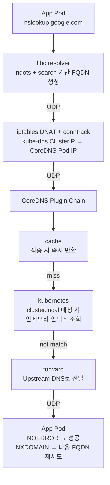

# 들어가며

운영 중인 Kubernetes 클러스터의 CoreDNS CPU 사용량을 줄여보려고 분석을 했다. 가장 큰 원인은 `ndots:5` 기본값으로 인한 **외부 도메인 1건당 최대 4배의 쿼리 증폭**이었다.

해결책은 단순해 보였다. `ndots`를 낮추면 된다. 그런데 AI에게 물어보면 "**해석 실패가 발생할 수 있다**"고 경고한다. 실제로 그 위험은 어디에서 오는가, 라고 물으면 명확한 답을 얻기 어려웠다.

결론부터 말하면 위험은 **컨테이너 이미지가 사용하는 libc**에 달려있고, **glibc 기반 이미지는 안전, musl(Alpine) 기반 이미지는 위험**하다.

<br>

# CoreDNS란

CoreDNS는 Kubernetes에서 클러스터 내부 DNS를 담당하는 컴포넌트로, `kube-system` 네임스페이스에 존재한다.
**자체 DNS 서버가 아니라 플러그인 체인 기반의 미들웨어**라는 점이 특징이다.

DNS Query를 수신하면 Zone을 매칭하고, 해당 Zone에 정의된 플러그인을 순서대로 실행하여 적절한 플러그인이 응답을 생성한다.

<br>

# CoreDNS 동작 과정

## Pod의 DNS Query 처리 흐름



핵심 흐름은 다음과 같다.

1. **App Pod**: 앱이 `google.com` 같은 도메인으로 DNS Query 요청
2. **libc resolver**: `/etc/resolv.conf`의 `ndots`/`search`를 기반으로 FQDN을 생성하여 순회
3. **iptables/conntrack**: kube-dns Service의 ClusterIP를 실제 CoreDNS Pod IP로 DNAT (UDP도 conntrack 추적)
4. **CoreDNS Plugin Chain**:
    - `cache`: 적중 시 즉시 반환, 미스 시 다음 플러그인으로
    - `kubernetes`: `cluster.local` 매칭 시 K8s API Watch 기반 인메모리 인덱스에서 해석
    - `forward`: 매칭되지 않으면 Upstream DNS로 전달
5. **App Pod**: `NOERROR` 받으면 연결 시작, `NXDOMAIN`이면 다음 FQDN으로 재시도

여기서 **NXDOMAIN을 받고 다음 FQDN으로 재시도**하는 이 과정이 ndots와 search가 만들어내는 쿼리 증폭의 정체다.

<br>

## CoreDNS의 핵심 설정 파일 3가지

| # | 파일 | 내용 | 위치 | 변경 시점 |
| --- | --- | --- | --- | --- |
| 1 | **`Corefile`** | Zone, Plugin Chain, fallthrough 등 **CoreDNS 전체 동작 정의** | `coredns` ConfigMap → `/etc/coredns/Corefile` | 런타임 (reload 가능) |
| 2 | **CoreDNS의 `resolv.conf`** | CoreDNS가 바라보는 **Upstream DNS 정의** | CoreDNS Pod의 `/etc/resolv.conf` | Pod 생성 시 (reload 불가) |
| 3 | **Pod의 `resolv.conf`** | **search 순회 동작 정의 (ndots, search)** | App Pod의 `/etc/resolv.conf` | Pod 생성 시 (reload 불가) |

이 글에서 다루는 ndots는 **세 번째 파일, App Pod의 `/etc/resolv.conf`**가 정의하는 동작이다.

<br>

# 불필요한 requests 제거 - ndots 조정

## Pod의 `/etc/resolv.conf` 기본 형태

Pod의 `dnsPolicy` 기본값은 `ClusterFirst`이며, 이때 kubelet이 다음 `resolv.conf`를 자동 주입한다.

```conf
nameserver 10.96.0.10
search <namespace>.svc.cluster.local svc.cluster.local cluster.local
options ndots:5
```

- `nameserver`: kube-dns Service의 ClusterIP
- `search`: 자동 부여된 3개 도메인 (Pod의 namespace 기준)
- `ndots`: **5** (Kubernetes 기본값)

## ndots 동작 원리

`search`는 DNS Query 알고리즘으로, **DNS Query 문자열에 점(`.`)의 개수 < `ndots` 이면**
→ search 리스트를 먼저 순차 시도 후, 실패 시 절대 도메인으로 질의한다.

예로, `google.com`은 아래 순서로 질의가 나간다.

```
google.com.<ns>.svc.cluster.local    → NXDOMAIN
google.com.svc.cluster.local         → NXDOMAIN
google.com.cluster.local             → NXDOMAIN
google.com                           → 정상 응답
```

`google.com`은 점이 1개로 `ndots:5`보다 작으므로 search list부터 시도한다.
search 3개를 모두 NXDOMAIN으로 받은 뒤에야 원본 도메인을 시도하여 정상 응답을 받는다.

> 기본값인 `ndots: 5`에서는 **외부 도메인 1건당 CoreDNS 질의가 최대 4배로 증가하는 구조**이다.
{: .prompt-warning }

외부 호출이 많은 워크로드(외부 API 호출, 로그/메트릭 전송 등)는 이로 인해 CoreDNS CPU의 상당 부분을 **불필요한 NXDOMAIN 처리**에 사용한다.

## 해결: ndots 낮추기

```yaml
spec:
  dnsConfig:
    options:
      - name: ndots
        value: "2"
```

`ndots:2`로 낮추면 점이 2개 이상인 도메인은 search 순회 없이 원본부터 시도한다.
대부분의 외부 도메인(`google.com`, `api.example.com` 등)이 여기에 해당하므로 NXDOMAIN 3번이 사라진다.

<br>

# AI한테 물어보면 장애 가능성이 있다고 한다. 왜 장애 가능성이 있다는걸까?

`ndots`를 낮추는 변경을 AI에게 검토 요청하면 거의 항상 **"클러스터 내부 서비스 해석이 실패할 수 있다"**고 경고한다. 이 경고의 논리는 다음과 같다.

`ndots:5`에서 `my-svc.default`(점 1개)를 질의하는 경우:

```
점 1 < ndots 5 → search 먼저
my-svc.default.<ns>.svc.cluster.local  → NXDOMAIN
my-svc.default.svc.cluster.local       → NOERROR  ✓
```

`ndots:1`로 낮춘 경우 동일 도메인을 질의하면:

```
점 1 ≥ ndots 1 → 원본 먼저
my-svc.default                         → NXDOMAIN (외부에 없음)
... 그 다음은?
```

**원본이 NXDOMAIN을 받은 뒤 search list로 fallback이 일어나는가**가 관건이다. fallback이 일어나면 결국 cluster.local 안에서 찾아 정상 동작한다. fallback이 일어나지 않으면 그대로 해석 실패다.

이 분기점이 바로 **컨테이너 이미지의 libc**에 달려있다.

<br>

# 핵심: glibc와 musl의 차이

`search`/`ndots`를 해석하는 주체는 **컨테이너 이미지의 libc(resolver)**이다.
어떤 libc를 쓰느냐에 따라 실제 질의 패턴이 달라진다.

## 1. glibc (Debian, Ubuntu, CentOS, RHEL, Amazon Linux 등)

- 원본 먼저 시도 → NXDOMAIN → **search fallback 수행** → 결국 성공
- 쿼리가 1~2회 추가 발생하지만 해석 자체는 성공한다

```
my-svc.default            → NXDOMAIN
↓ search fallback
my-svc.default.<ns>.svc.cluster.local  → NXDOMAIN
my-svc.default.svc.cluster.local       → NOERROR  ✓
```

### 코드 — `glibc/resolv/res_query.c` `__res_context_search()`

```c
/*
 * If there are enough dots in the name, let's just give it a
 * try 'as is'. The threshold can be set with the "ndots" option.
 * Also, query 'as is', if there is a trailing dot in the name.
 */
saved_herrno = -1;
if (dots >= statp->ndots || trailing_dot) {
    ret = __res_context_querydomain (ctx, name, NULL, class, type, ...);
    if (ret > 0 || trailing_dot ...)
        return (ret);
    saved_herrno = h_errno;
    tried_as_is++;
    ...
}

/*
 * We do at least one level of search if
 *  - there is no dot and RES_DEFNAME is set, or
 *  - there is at least one dot, there is no trailing dot,
 *    and RES_DNSRCH is set.
 */
if ((!dots && (statp->options & RES_DEFNAMES) != 0) ||
    (dots && !trailing_dot && (statp->options & RES_DNSRCH) != 0)) {
    int done = 0;
    for (size_t domain_index = 0; !done; ++domain_index) {
        const char *dname = __resolv_context_search_list (ctx, domain_index);
        if (dname == NULL) break;
        searched = 1;
        ...
        ret = __res_context_querydomain (ctx, name, dname, class, type, ...);
    }
}
```

핵심은 두 `if` 블록이 **순차적**이라는 점이다.
첫 번째 블록(`dots >= ndots`)에서 절대 쿼리를 시도하고, 실패하면 `return`하지 않고 `saved_herrno`만 저장한 채 그 아래 search list 루프로 **fallthrough**한다. 두 경로 모두 시도하므로 결국 해석에 성공한다.

[bminor/glibc — `resolv/res_query.c`](https://github.com/bminor/glibc/blob/master/resolv/res_query.c)

## 2. musl libc (Alpine)

- 경량 설계로 `resolv.conf` 옵션 지원이 제한적이다
- `dots ≥ ndots`이면 내부적으로 `*search = 0`으로 set하여 **search list를 아예 건너뛴다**
- 원본만 시도 → NXDOMAIN → **★ 해석 실패 (재시도 없음)**

```
my-svc.default            → NXDOMAIN
                          ✗ 끝. search 시도 안 함.
```

### 코드 — `musl/src/network/lookup_name.c` `name_from_dns_search()`

```c
static int name_from_dns_search(struct address buf[static MAXADDRS],
                                char canon[static 256],
                                const char *name, int family)
{
    char search[256];
    struct resolvconf conf;
    size_t l, dots;
    char *p, *z;

    if (__get_resolv_conf(&conf, search, sizeof search) < 0) return -1;

    /* Count dots, suppress search when >=ndots or name ends in
     * a dot, which is an explicit request for global scope. */
    for (dots=l=0; name[l]; l++) if (name[l]=='.') dots++;
    if (dots >= conf.ndots || name[l-1]=='.') *search = 0;

    ...
    memcpy(canon, name, l);
    canon[l] = '.';

    for (p=search; *p; p=z) {           // ← *search = 0 이면 *p == 0 이라
        for (; isspace(*p); p++);       //    이 루프가 즉시 종료
        for (z=p; *z && !isspace(*z); z++);
        if (z==p) break;
        if (z-p < 256 - l - 1) {
            memcpy(canon+l+1, p, z-p);
            canon[z-p+1+l] = 0;
            int cnt = name_from_dns(buf, canon, canon, family, &conf);
            if (cnt) return cnt;
        }
    }

    canon[l] = 0;
    return name_from_dns(buf, canon, name, family, &conf);  // ← 절대 쿼리 1회로 끝
}
```

`*search = 0`이 set되면 그 아래 for 루프(search list 순회)는 **루프 본문에 진입조차 하지 않는다.**
이후 절대 쿼리 한 번을 시도하고 그 결과를 그대로 반환할 뿐, glibc처럼 NXDOMAIN을 받은 뒤 search list로 돌아가는 fallback 경로가 **존재하지 않는다.**

[kraj/musl — `src/network/lookup_name.c`](https://github.com/kraj/musl/blob/master/src/network/lookup_name.c) (`name_from_dns_search` 함수, master 기준 199-202행)

## 정리

| 조건 | glibc | musl |
| --- | --- | --- |
| 점 < ndots | search 먼저 → 실패 시 원본 | search 먼저 → 실패 시 원본 |
| 점 ≥ ndots | 원본 먼저 → 실패 시 **search fallback** | 원본만 시도 → 실패 시 **그대로 종료** |

`ndots:5` 기본값에서는 대부분의 도메인이 점 < 5라 두 libc 모두 search를 먼저 돌리므로 동작 차이가 드러나지 않는다.
하지만 **`ndots`를 낮추는 순간 점 ≥ ndots가 되는 도메인이 늘어나면서 musl의 fallback 부재가 실제 장애로 이어진다.**

<br>

# 실습: glibc vs musl 차이 직접 확인

`kind`로 로컬 클러스터를 띄우고 **(libc 2종) × (ndots 2종) = 4개 Pod**를 만들어 비대칭을 재현한다.

## 1. 클러스터 생성

`kind-config.yaml` — 1노드면 충분하다.

```yaml
kind: Cluster
apiVersion: kind.x-k8s.io/v1alpha4
name: dns-poc
nodes:
  - role: control-plane
```

```bash
kind create cluster --config kind-config.yaml
```

## 2. CoreDNS 로그 활성화

CoreDNS가 어떤 쿼리를 받았는지 봐야 비대칭이 보인다. Corefile에 `log` 한 줄을 추가한다.

`coredns-log-patch.yaml`:

```yaml
apiVersion: v1
kind: ConfigMap
metadata:
  name: coredns
  namespace: kube-system
data:
  Corefile: |
    .:53 {
        log
        errors
        health {
           lameduck 5s
        }
        ready
        kubernetes cluster.local in-addr.arpa ip6.arpa {
           pods insecure
           fallthrough in-addr.arpa ip6.arpa
           ttl 30
        }
        prometheus :9153
        forward . /etc/resolv.conf {
           max_concurrent 1000
        }
        cache 30
        loop
        reload
        loadbalance
    }
```

```bash
kubectl apply -f coredns-log-patch.yaml
kubectl rollout restart deployment/coredns -n kube-system
```

## 3. 테스트 Pod 4종

`pods.yaml` — 핵심은 **`spec.dnsConfig.options`로 ndots를 Pod 단위로 오버라이드**하는 부분이다. (아래는 `alpine-ndots2` 발췌, 나머지 3개도 같은 패턴)

```yaml
---
apiVersion: v1
kind: Pod
metadata:
  name: alpine-ndots5
  labels: { app: dns-poc, libc: musl, ndots: "5" }
spec:
  containers:
    - name: shell
      image: alpine:3.20
      command: ["sh", "-c"]
      args:
        - |
          apk add --no-cache bind-tools musl-utils >/dev/null 2>&1 || true
          tail -f /dev/null
---
apiVersion: v1
kind: Pod
metadata:
  name: alpine-ndots2
  labels: { app: dns-poc, libc: musl, ndots: "2" }
spec:
  dnsConfig:
    options:
      - name: ndots
        value: "2"
  containers:
    - name: shell
      image: alpine:3.20
      command: ["sh", "-c"]
      args:
        - |
          apk add --no-cache bind-tools musl-utils >/dev/null 2>&1 || true
          tail -f /dev/null
---
apiVersion: v1
kind: Pod
metadata:
  name: debian-ndots5
  labels: { app: dns-poc, libc: glibc, ndots: "5" }
spec:
  containers:
    - name: shell
      image: debian:12-slim
      command: ["sh", "-c"]
      args:
        - |
          apt-get update -qq >/dev/null 2>&1 && apt-get install -y -qq dnsutils >/dev/null 2>&1 || true
          tail -f /dev/null
---
apiVersion: v1
kind: Pod
metadata:
  name: debian-ndots2
  labels: { app: dns-poc, libc: glibc, ndots: "2" }
spec:
  dnsConfig:
    options:
      - name: ndots
        value: "2"
  containers:
    - name: shell
      image: debian:12-slim
      command: ["sh", "-c"]
      args:
        - |
          apt-get update -qq >/dev/null 2>&1 && apt-get install -y -qq dnsutils >/dev/null 2>&1 || true
          tail -f /dev/null
```

| Pod | libc | ndots |
| --- | --- | --- |
| `alpine-ndots5` | musl | 5 (기본) |
| `alpine-ndots2` | musl | **2** |
| `debian-ndots5` | glibc | 5 (기본) |
| `debian-ndots2` | glibc | **2** |

```bash
kubectl apply -f pods.yaml
kubectl wait --for=condition=Ready pod -l app=dns-poc --timeout=120s
```

## 4. 메인 실험: `kubernetes.default.svc` 조회 (점 2개)

이 도메인은 `ndots:5`에선 점 < ndots → search 우선, `ndots:2`에선 점 ≥ ndots → 원본 우선이다. 즉 **ndots:2 환경에서만 libc 차이가 드러난다.**

```bash
NAME=kubernetes.default.svc
for p in alpine-ndots5 alpine-ndots2 debian-ndots5 debian-ndots2; do
  printf "===== [%s] =====\n" "$p"
  kubectl exec "$p" -- sh -c "getent hosts $NAME; echo exit=\$?"
done
```

### 결과

```
===== [alpine-ndots5] =====
10.96.0.1       kubernetes.default.svc.cluster.local
exit=0

===== [alpine-ndots2] =====
exit=2                          # ← musl, search 폴백 없음 → 실패

===== [debian-ndots5] =====
10.96.0.1       kubernetes.default.svc.cluster.local
exit=0

===== [debian-ndots2] =====
10.96.0.1       kubernetes.default.svc.cluster.local
exit=0                          # ← glibc, NXDOMAIN 후 search 폴백 → 성공
```

`alpine-ndots2`만 실패. **앞에서 설명한 musl의 search fallback 부재가 그대로 재현된다.**

## 5. CoreDNS 로그로 검증

```bash
kubectl logs -n kube-system -l k8s-app=kube-dns -f --tail=20 --prefix
```

**`alpine-ndots2`의 source IP**:

```
... kubernetes.default.svc.   AAAA  NXDOMAIN
... kubernetes.default.svc.   A     NXDOMAIN
```

2줄로 끝. **search list로 확장된 쿼리가 아예 들어오지 않는다.** musl이 `*search = 0`으로 만들어 search loop 자체를 진입하지 않은 결과다.

**`debian-ndots2`의 source IP**:

```
... kubernetes.default.svc.                                A  NXDOMAIN
... kubernetes.default.svc.default.svc.cluster.local.      A  NXDOMAIN
... kubernetes.default.svc.svc.cluster.local.              A  NXDOMAIN
... kubernetes.default.svc.cluster.local.                  A  NOERROR  10.96.0.1
```

원본 NXDOMAIN 후 search list 3개를 차례로 시도하여 마지막에 성공.

> 이 실패는 CoreDNS, 네트워크, 서비스 등록 모두 정상인 상태에서 발생한다.
> **인프라 레벨 모니터링으로는 잡히지 않고 클라이언트 libc에서만 일어나는 결함**이라는 점이 핵심이다.
{: .prompt-warning }

## 6. 정리

```bash
kind delete cluster --name dns-poc
```

<br>

# 결론

| | 권장 |
| --- | --- |
| **glibc 기반 이미지만 사용** | `ndots`를 안전하게 낮출 수 있다 (`2` 또는 `1`) |
| **musl(Alpine) 기반 이미지가 섞여있음** | `ndots`를 그대로 두고, 다른 방법 사용 |

musl 환경에서도 ndots를 낮추고 싶다면 다음을 함께 적용해야 한다.

1. **베이스 이미지 교체 검토**: `alpine` → `debian-slim`, `distroless` 등
2. **앱 레벨에서 FQDN 사용**: `my-svc.default.svc.cluster.local.` (끝의 `.` 포함 시 search 자체를 건너뜀)
3. **점진적 적용**: 클러스터 전체가 아닌 특정 워크로드의 `dnsConfig`로 먼저 시도
4. **NodeLocal DNSCache 병행**: ndots와 무관하게 캐시 계층을 추가하면 CoreDNS 부하를 크게 줄일 수 있다

> "AI가 장애 가능성을 경고했다"는 것은 **워크로드에 musl 기반 이미지가 있을 가능성**을 경고한 것이다.
> 베이스 이미지를 먼저 확인하면 위험 여부가 결정된다.
{: .prompt-tip }
